# Лабораторная работа 1. Передискретизация, обесцвечивание и бинаризация растровых изображений

## 1. Передискретизация
1) Исходное изображение
   

   
2) Растяжение (интерполяция) изображения в M = 4 раз.

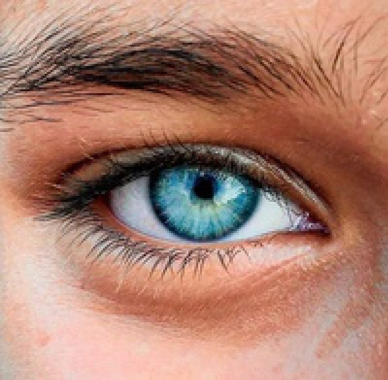
   
3) Сжатие (децимация) изображения в N = 3 раз.   
   
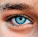
   
4) Передискретизация изображения в K = 4/3 раз путём растяжения и
последующего сжатия (в два прохода).
   

   
5) Передискретизация изображения в K раз за один проход.  
   

   
## 2. Приведение полноцветного изображения к полутоновому.
1) Исходное изображение
   

   
2) Создание нового изображения в режиме полутона (1 яркостный канал).
   
3) Попиксельный расчёт яркости нового изображения на основе полноцветного
путём усреднения по каналам.
   
4) Получившееся изображение.
   
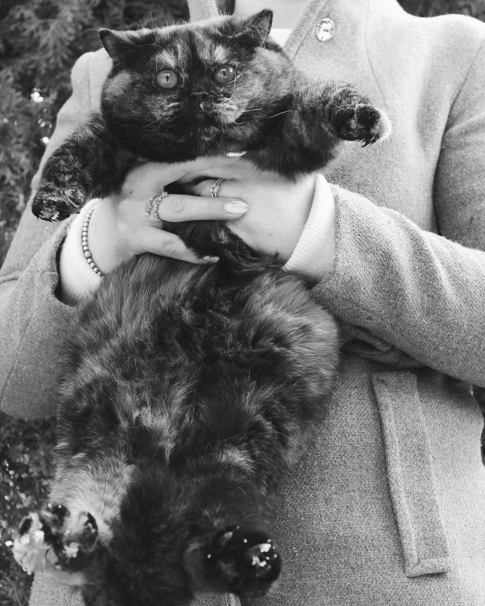

## 3. Приведение полутонового изображения к монохромному методом пороговой обработки. Один алгоритм на выбор:

### Улучшенный алгоритм адаптивной бинаризации Бернсена.

В зависимости от рода изображения задается разный коэффициент INDENT.  
INDENT - отступ от рассчитываемого пикселя. На его основе рассчитывается площадь и средняя яркость зоны вокруг пикселя.    

**Темно-зеленым цветом обозначается рассчитываемый пиксель.
Коралловым - отступы(INDENT)**   

**INDENT = 3**

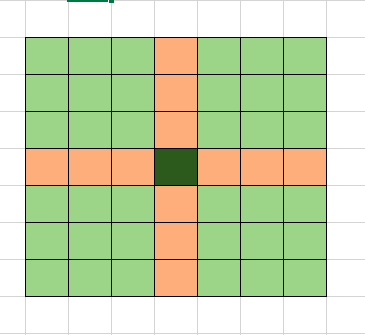

**INDENT = 2**  

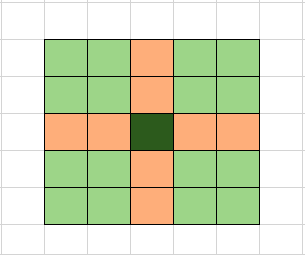

Было замечено, что для бинаризации мелкими деталями(текст) наиболее подходит небольшое значение данного коэффициента (< 10).При задание большего значения
появляются шумы и пропадает четкость.
  
Для изображений с выраженными деталями(человек, предметы, композиция) удобно использовать коэффициента > 20. При задании меньшего коэффициента
детали становятся неярко выражены.

### Пример:
1) INDENT = 3 

Обработка текста: 
   
   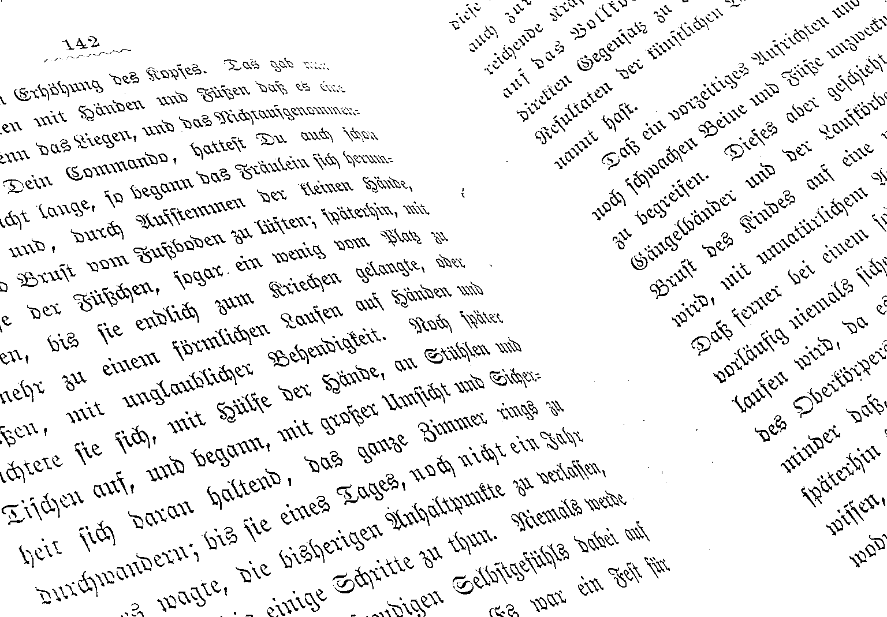

Обработка картинки:

   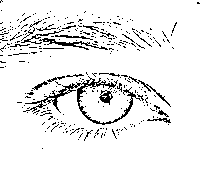

2) INDENT = 20 

Обработка текста: 

   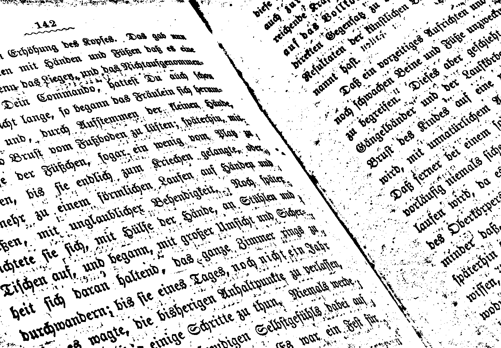

Обработка картинки:

   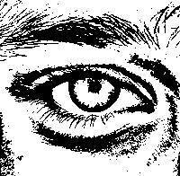

## Где использовать бинаризацию
Бинаризация плохо подходит для обработки изображений-фото, где преобладают либо светлые, либо темные оттенки. Картинка 
в результате получается трудно разборчивая, элементы плохо различаются.

Для текстов или элементов с явно выраженными различиями в цветах, картинок с высокой контрастностью бинаризация дает понятный и различимый результат.

### Пример 
 - Исходное изображение

- INDENT = 20

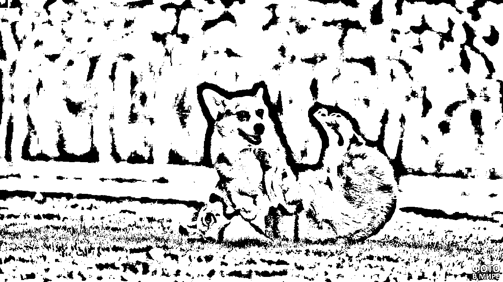

- INDENT = 10

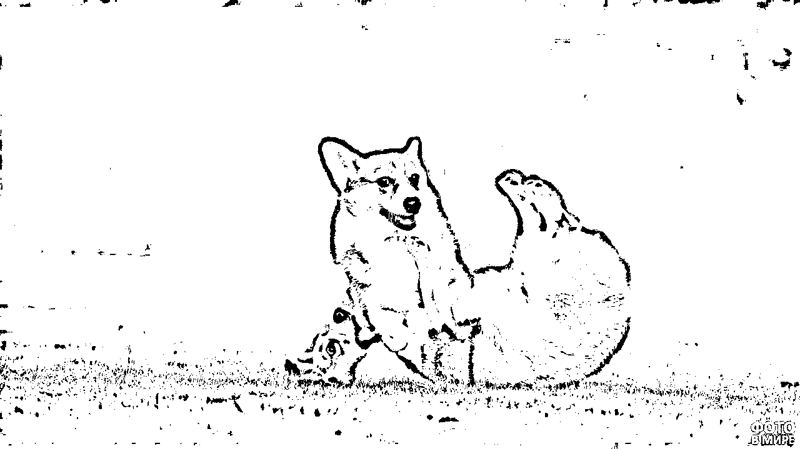

- INDENT = 5

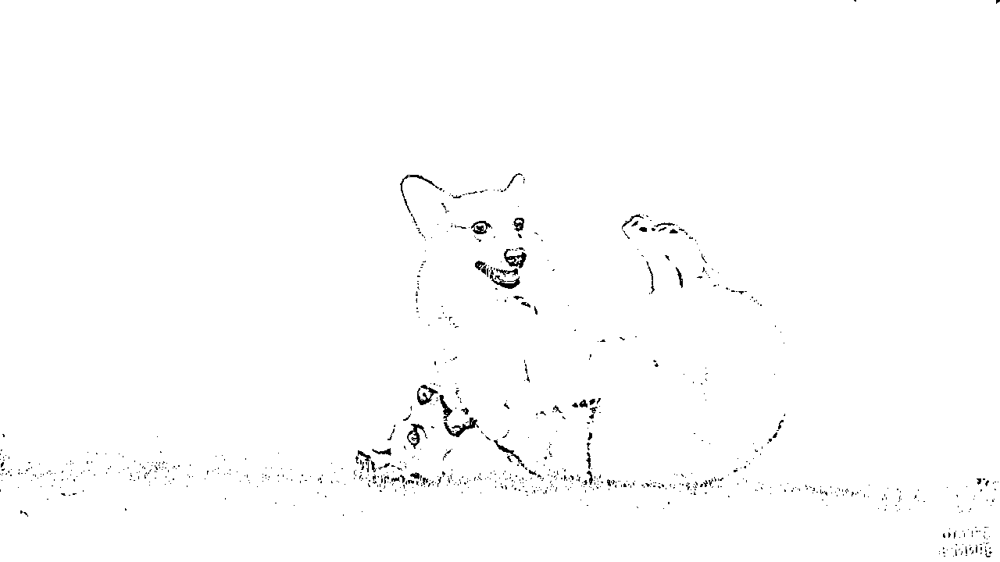
