# Лабораторная работа 2. Фильтрация изображений и морфологические операции

Аскреткова Валентина Б18-514

Операция морфологического закрытия Closing.

## Обработка
1) Текст

- Исходное монохромное изображение

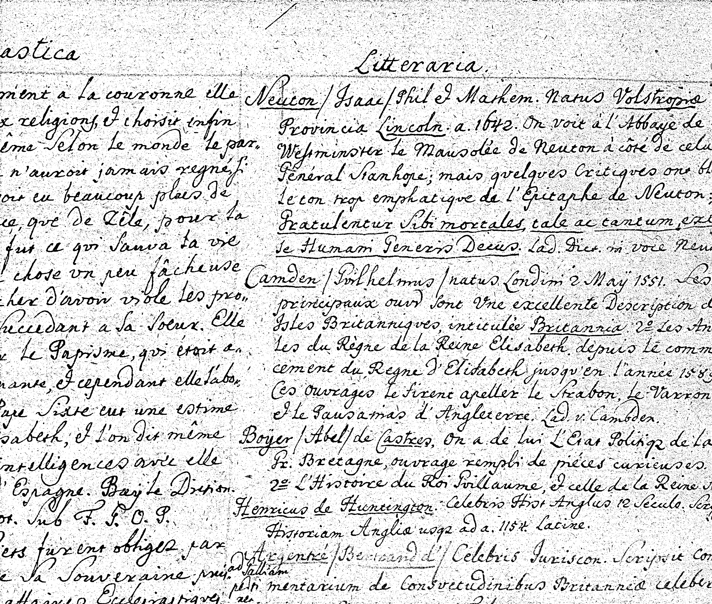

- После расширения

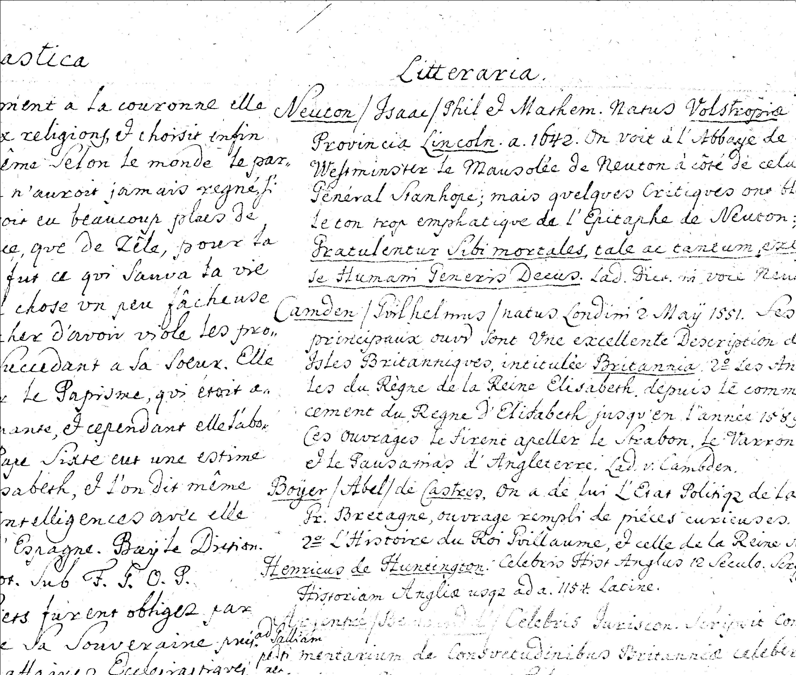

- Итоговое изображение

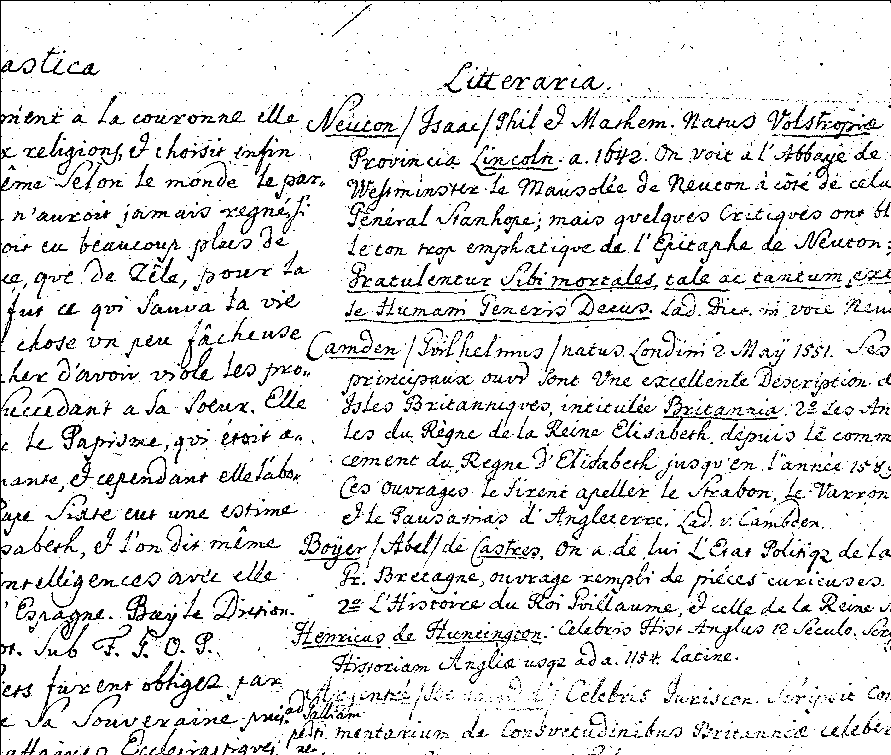

- Разница изображений

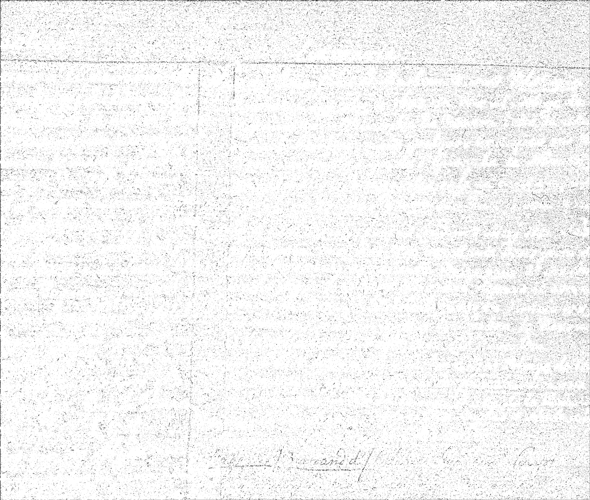

2) Картина с сильно выраженным шумом

- Исходное монохромное изображение

- После расширения

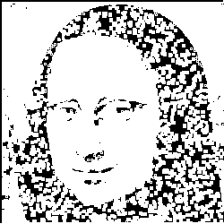

- Итоговое изображение

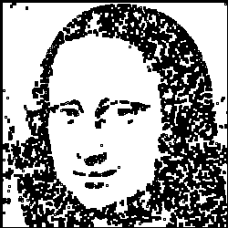

- Разница 

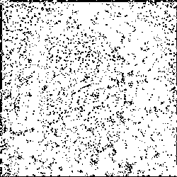

3) Портрет

- Исходное монохромное изображение

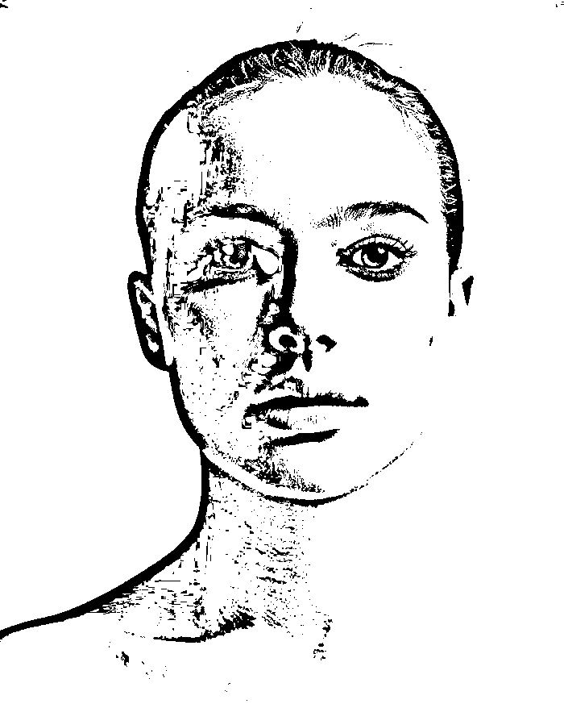

- После расширения

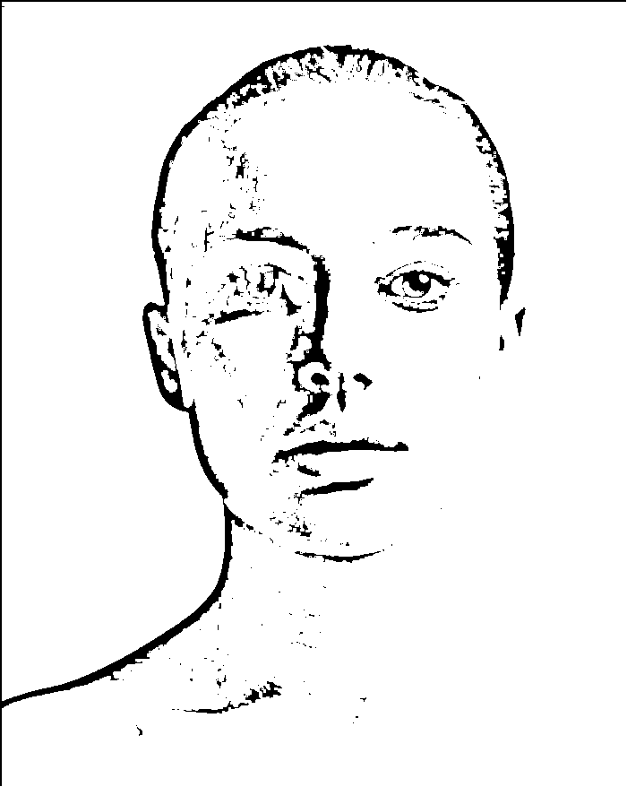

- Итоговое изображение

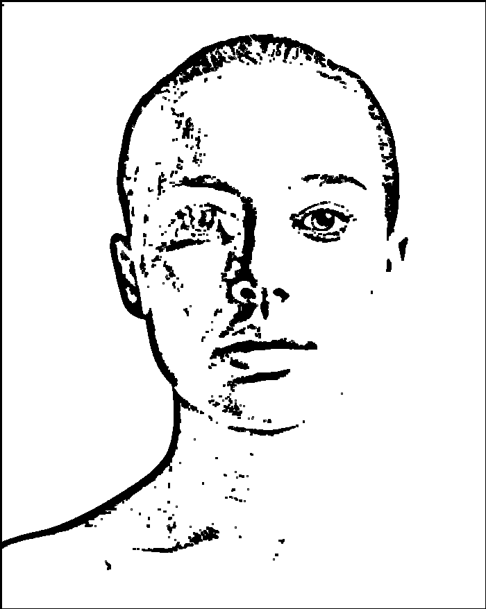

- Разница 

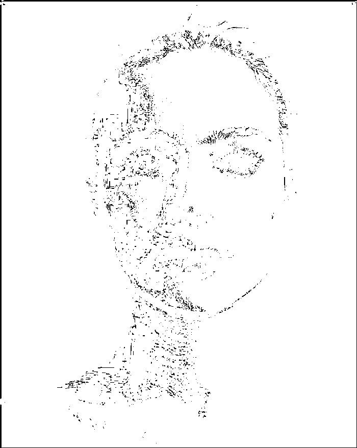

## Итог

Метод плохо подходит для обработки изображений-фото, убираются части изображения (тени и т д), важные для понимания.
Для текстов или элементов с явно выраженными различиями черном/белом метод хорошо устраняет шум.
