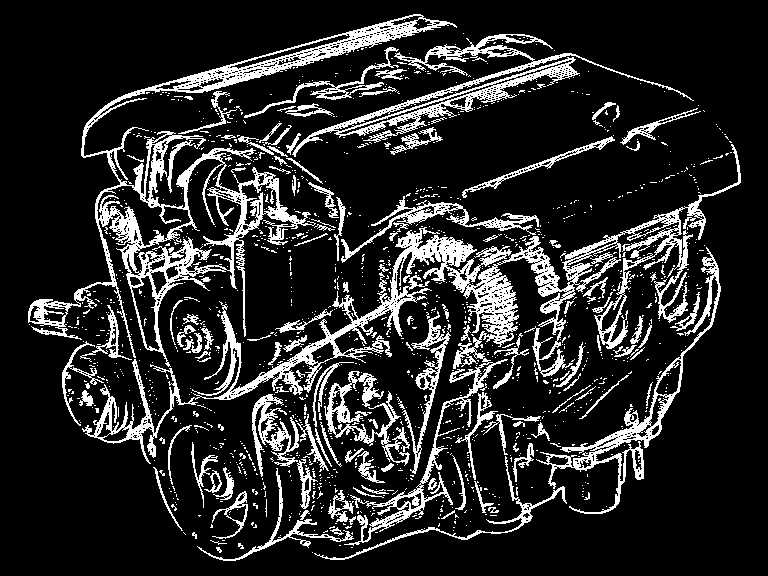
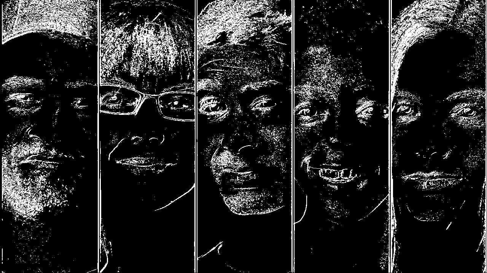

# Лабораторная работа №3. Выделение контуров на изображении

Аскреткова Валентина б18-514

Оператор Робертса

### Исходное изображение

### После приведения к полутону

## Выделение контура

Пороговую границу обозначим T. В зависимости от ее выбора контуры изображения, выделенные с помощью оператора Робертса меняются.

#### T = 2

#### T = 10

#### T = 20

#### T = 50

#### T = 200

Вывод: для данного изображения с мелкими деталями лучше всего подходит порог в диапазоне от 10 до 20. При выборе меньше появляются шумы, при выборе больше - детали пропадают, контур плохо читается и постепенно сливается с фоном

Градиентные матрицы

G_x

G_y

G = |G_x| + |G_y|

### Изображение людей

#### Исходное изображение

#### После приведения к полутону

#### T = 2

#### T = 10

#### T = 20

 Вывод: для обработки изображений с разными цветами, небольшой контрастностью и нечетко выраженными линиями, деталями оператор подходит плохо. Тени обрабатываются плохо и ухудшают четкость изображение. Самый лучший диапазон, при котором можно распознать изображение - от 10 до 20.
