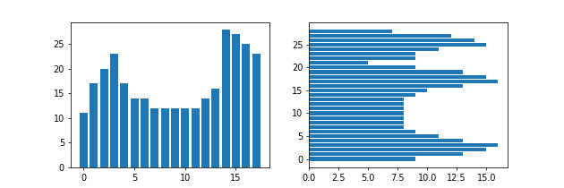

# Лабораторная работа No4. Выделение признаков символов

Аскреткова Валентина

Армянские строчные буквы

## Эталонные изображения символов. Профили X и Y

1.

2.

3.

4.

5.

6.

7.

8.

9.

10.

11.

12.

13.

14.

15.

16.

17.

18.

19.

20.

21.

22.

23.

24.

25.

26.

27.

28.

29.

30.

31.

32.

33.

34.

35.

36.

37.

38.

### Признаки

|буква|Вес черного|Удельный вес       |Координаты центра тяжести x|Координаты центра тяжести y|Нормированные координаты центра тяжести x|Нормированные координаты центра тяжести y|Осевые моменты инерции по x|Нормированные осевые моменты инерции по x|Осевые моменты инерции по  y|Нормированные осевые моменты инерции по y|
|-----|-----------|-------------------|---------------------------|---------------------------|-----------------------------------------|-----------------------------------------|---------------------------|-----------------------------------------|----------------------------|-----------------------------------------|
|ա    |305        |0.5187074829931972 |13.652459016393443         |11.268852459016394         |0.46860959319975715                      |0.5134426229508197                       |76.23293738242407          |0.06223096929177475                      |247.46900295619457          |0.2020155126173017                       |
|բ    |260        |0.49808429118773945|6.846153846153846          |11.946153846153846         |0.3438914027149321                       |0.39093406593406593                      |64.86443786982248          |0.055677629072808994                     |25.54136094674556           |0.02192391497574726                      |
|գ    |279        |0.4373040752351097 |10.706093189964157         |12.078853046594983         |0.462194913807817                        |0.39567332309267794                      |62.74456905743759          |0.04735439174146233                      |79.58686296424763           |0.060065556954149155                     |
|դ    |248        |0.4072249589490969 |9.314516129032258          |11.459677419354838         |0.4157258064516129                       |0.37355990783410137                      |72.93710978147764          |0.0568932213584069                       |72.93710978147764           |0.0568932213584069                       |
|ե    |260        |0.49808429118773945|7.230769230769231          |16.053846153846155         |0.36651583710407243                      |0.5376373626373627                       |25.541360946745577         |0.021923914975747277                     |0.8952071005917129          |0.0007684181120958909                    |
|զ    |276        |0.43260188087774293|10.753623188405797         |12.61231884057971          |0.4644582470669427                       |0.41472567287784684                      |236.78073146397813         |0.17870243884073822                      |70.35319523209408           |0.05309675111856157                      |
|է    |200        |0.43103448275862066|4.59                       |15.17                      |0.23933333333333331                      |0.5060714285714286                       |17.3889                    |0.015851321786690974                     |0.028899999999999974        |2.6344576116681837e-05                   |
|ը    |287        |0.5498084291187739 |7.599303135888502          |14.038327526132404         |0.38819430211108835                      |0.4656545545047287                       |194.92829826755212         |0.16732042769746963                      |8.771503842465005           |0.007529187847609447                     |
|թ    |337        |0.48419540229885055|9.543026706231455          |11.264094955489615         |0.3714359437491937                       |0.3665748198389148                       |0.5415562345358323         |0.0003821850631868965                    |137.73146721376432          |0.09719934171754716                      |
|ժ    |270        |0.4047976011994003 |11.025925925925925         |15.362962962962962         |0.4557239057239057                       |0.512962962962963                        |19.035445816186552         |0.013894485997216462                     |44.05026063100138           |0.03215347491313969                      |
|ի    |264        |0.41971383147853736|6.234848484848484          |17.098484848484848         |0.3271780303030303                       |0.4471801346801347                       |118.84303259871443         |0.07167854800887481                      |1.206668962350779           |0.0007277858639027617                    |
|լ    |136        |0.5210727969348659 |2.161764705882353          |15.838235294117647         |0.1452205882352941                       |0.529936974789916                        |147.90852076124568         |0.16042138911198014                      |61.43793252595155           |0.06663550165504507                      |
|խ    |372        |0.3590733590733591 |11.459677419354838         |18.053763440860216         |0.38739545997610514                      |0.473715651135006                        |98.92762169036881          |0.045948732786980404                     |80.03514857208924           |0.037173780107798066                     |
|ծ    |256        |0.44912280701754387|8.99609375                 |16.44140625                |0.4442274305555556                       |0.5324622844827587                       |30.897964477539062         |0.024502747404868408                     |2.4292144775390625          |0.0019264190940040146                    |
|կ    |263        |0.41812400635930047|8.1787072243346            |18.870722433460077         |0.4486692015209125                       |0.49640895648500216                      |293.41214995156787         |0.17696752108055963                      |8.241047289970949           |0.004970474843167038                     |
|հ    |232        |0.47058823529411764|6.887931034482759          |14.974137931034482         |0.36799568965517243                      |0.49907635467980294                      |169.67308263971464         |0.15015317047762358                      |1.0523929845422129          |0.0009313212252585955                    |
|ձ    |224        |0.4392156862745098 |8.370535714285714          |18.004464285714285         |0.4606584821428571                       |0.5863608374384236                       |120.90180564413268         |0.10168360441054052                      |4.017877072704078           |0.0033792069576989723                    |
|ղ    |248        |0.4072249589490969 |9.314516129032258          |11.975806451612904         |0.4157258064516129                       |0.3919930875576037                       |256.7747788761706          |0.20029233921698175                      |64.38768210197709           |0.05022440101558275                      |
|ճ    |271        |0.5496957403651116 |8.118081180811808          |15.350553505535055         |0.444880073800738                        |0.5125197680548234                       |160.00849661633148         |0.1416004394834792                       |0.4217807491728055          |0.00037325730015292524                   |
|մ    |248        |0.4072249589490969 |9.71774193548387           |16.024193548387096         |0.4358870967741935                       |0.5365783410138248                       |169.62961758584805         |0.1323163943727364                       |15.80703694068679           |0.012329982013016218                     |
|յ    |124        |0.6108374384236454 |4.104838709677419          |14.75                      |0.5174731182795699                       |0.49107142857142855                      |105.0625                   |0.11804775280898877                      |76.5625                     |0.0860252808988764                       |
|ն    |248        |0.4072249589490969 |10.685483870967742         |16.024193548387096         |0.4842741935483871                       |0.5365783410138248                       |143.41994016649326         |0.11187202821099318                      |15.80703694068679           |0.012329982013016218                     |
|շ    |193        |0.39148073022312374|8.699481865284975          |15.031088082901555         |0.4812176165803109                       |0.5011102886750555                       |36.37402346371715          |0.03218940129532491                      |0.9387903030953849          |0.0008307878788454733                    |
|ո    |199        |0.5574229691876751 |7.763819095477387          |8.849246231155778          |0.42273869346733667                      |0.3924623115577889                       |124.33930961339362         |0.17032782138821045                      |51.13327946263985           |0.0700455883049861                       |
|չ    |156        |0.41935483870967744|4.8076923076923075         |17.743589743589745         |0.34615384615384615                      |0.5581196581196581                       |150.2195923734385          |0.13594533246465024                      |45.47600262984879           |0.041154753511175375                     |
|պ    |341        |0.41995073891625617|14.859237536656892         |12.604105571847507         |0.5133050939502553                       |0.4144323418516967                       |237.033565242817           |0.14586680938019508                      |207.241776386512            |0.12753340085323814                      |
|ջ    |227        |0.5218390804597701 |6.466960352422907          |13.801762114537445         |0.3904971680302077                       |0.4572057898049087                       |23.05691940460711          |0.021629380304509484                     |0.03929825923266527         |3.686515875484547e-05                    |
|ռ    |212        |0.5608465608465608 |7.716981132075472          |9.75943396226415           |0.3951165371809101                       |0.4379716981132075                       |104.86919277322892         |0.13708391212186788                      |52.42579654681382           |0.06853045300237101                      |
|ս    |200        |0.5602240896358543 |8.25                       |11.19                      |0.453125                                 |0.5095                                   |77.6161                    |0.10632342465753425                      |23.136100000000006          |0.03169328767123288                      |
|վ    |279        |0.3590733590733591 |10.261648745519713         |19.767025089605735         |0.46308243727598564                      |0.5213062524890482                       |263.5094744414897          |0.14558534499529818                      |0.054277308873215954        |2.998746346586517e-05                    |
|տ    |310        |0.5272108843537415 |13.480645161290322         |10.012903225806452         |0.46224611708482677                      |0.4506451612903226                       |99.74210197710717          |0.08142212406294463                      |288.56145681581677          |0.23556037291087084                      |
|ր    |231        |0.4685598377281947 |6.896103896103896          |11.017316017316018         |0.3685064935064935                       |0.3577612863327149                       |80.68861153276737          |0.07140585091395342                      |24.82713967129551           |0.021970920063093372                     |
|ց    |309        |0.5919540229885057 |9.229773462783172          |13.909385113268609         |0.48410432134018655                      |0.46104946833102173                      |65.4580492453996           |0.056187166734248575                     |9.551900378085689           |0.008199056118528489                     |
|ո    |199        |0.5574229691876751 |7.763819095477387          |8.849246231155778          |0.42273869346733667                      |0.3924623115577889                       |124.33930961339362         |0.17032782138821045                      |51.13327946263985           |0.0700455883049861                       |
|ւ    |116        |0.4603174603174603 |3.1551724137931036         |12.344827586206897         |0.19592476489028215                      |0.5672413793103448                       |58.60166468489893          |0.10017378578615202                      |1.8085612366230683          |0.0030915576694411423                    |
|փ    |370        |0.35714285714285715|13.464864864864865         |18.037837837837838         |0.46166166166166167                      |0.4732732732732733                       |99.24467494521548          |0.04609599393646794                      |80.32035062089116           |0.03730624738545804                      |
|ք    |281        |0.4844827586206897 |9.053380782918149          |12.03914590747331          |0.42386214646937626                      |0.39425521098118965                      |63.375197882498945         |0.05106784680298062                      |48.45348969744556           |0.039043907894799                        |
|ե    |260        |0.49808429118773945|7.230769230769231          |16.053846153846155         |0.36651583710407243                      |0.5376373626373627                       |25.541360946745577         |0.021923914975747277                     |0.8952071005917129          |0.0007684181120958909                    |
|ւ    |116        |0.4603174603174603 |3.1551724137931036         |12.344827586206897         |0.19592476489028215                      |0.5672413793103448                       |58.60166468489893          |0.10017378578615202                      |1.8085612366230683          |0.0030915576694411423                    |
|օ    |210        |0.5263157894736842 |8.914285714285715          |10.0                       |0.4396825396825397                       |0.45                                     |9.0                        |0.011221945137157107                     |64.0                        |0.0798004987531172                       |
|ֆ    |402        |0.4178794178794179 |12.151741293532337         |16.492537313432837         |0.4460696517412935                       |0.4303482587064677                       |20.317219870795263         |0.009935070841464676                     |72.37692136333256           |0.03539213758598169                      |
