# Лабораторная работа No5. Сегментация текста

Аскреткова Валентина Б18-514    
Армянский текст

## Исходный текст


## Горизонтального и вертикального профиля изображения.

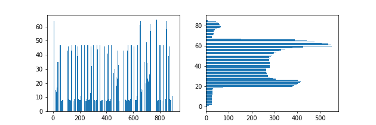

```python

[
     (1, 41), 
     (49, 75),
     (107, 169), 
     (179, 216),
     (227, 289),
     (299, 337),
     (347, 373),
     (380, 442),
     (450, 496),
     (527, 589),
     (599, 636),
     (647, 687),
     (693, 733), 
     (769, 790),
     (795, 833),
     (837, 852),
     (863, 900)
 ]


```

### Процент совпадения 100 %
## Профили 

 


1. 


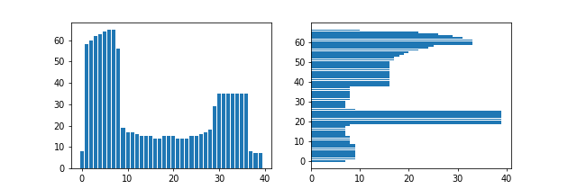

2. 


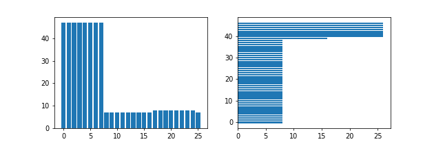

3. 


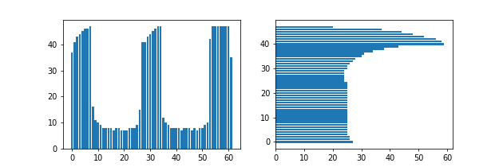

4. 


5. 


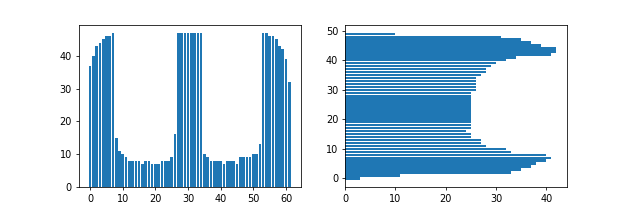

6. 


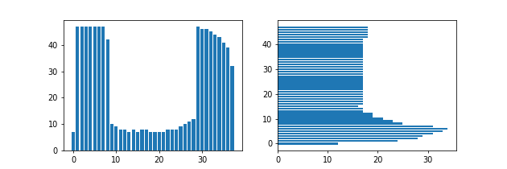

7. 


8. 


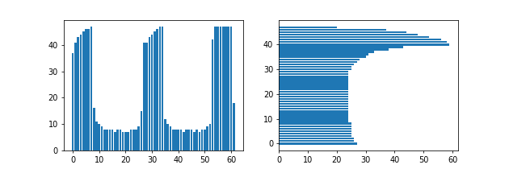

9. 


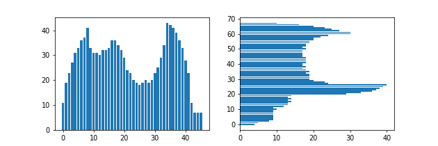

10. 


11. 


12. 


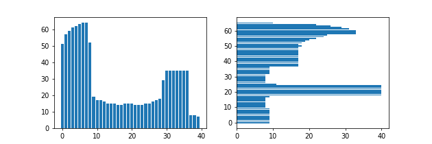

13. 


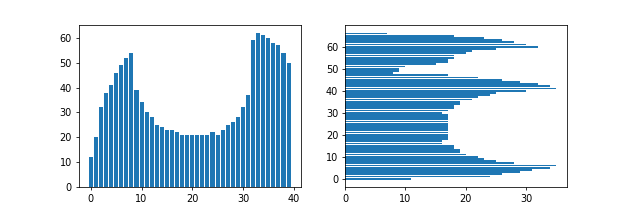

14. 


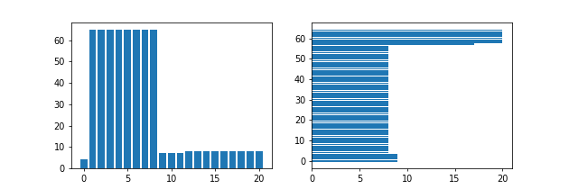

15. 


16. 


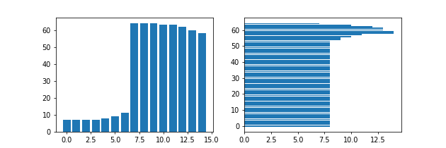

17. 


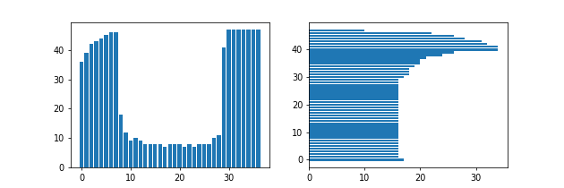

