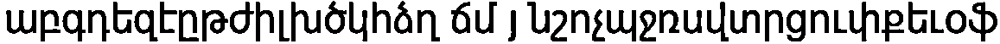
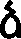
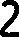
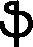

# Лабораторная работа No6. Классификация на основе признаков, анализ профилей

Аскреткова Валентина
Б18-514

## Исходный текст

## Results

#### Процент совпадения - 97%

0. 

#### Фактические значения

+ Удельный вес = 0.5051020408163265

+ Нормированные координаты центра тяжести x = 0.3462064251537936

+ Нормированные координаты центра тяжести y = 0.4082687338501292

+ Нормированные осевые моменты инерции по x = 0.2732227822650824

+ Нормированные осевые моменты инерции по y = 0.1217934999999997

+ Диагональный осевой момент инерции  = 0.2432413276902399

+ Диагональный осевой момент инерции  = 0.2227981942648157

#### Теоретическое значение самого подходящего варианта ա

+ Удельный вес = 0.5187074829931972

+ Нормированные координаты центра тяжести x = 0.46860959319975715

+ Нормированные координаты центра тяжести y = 0.5134426229508197

+ Нормированные осевые моменты инерции по x = 0.12553565276388773

+ Нормированные осевые моменты инерции по y = 0.2803242209700373

+ Диагональный осевой момент инерции  = 0.2060957348852987

+ Диагональный осевой момент инерции  = 0.19976413884862607

#### Значения для всего алфавита

ա : 0.9652010366215291; 

տ : 0.9251418655569283; 

ս : 0.8846836348217468; 

պ : 0.85875463205817; 

օ : 0.8585099888026663; 

ո : 0.8298042331555923; 

ո : 0.8298042331555923; 

ռ : 0.8207698604511523; 

փ : 0.8194898921089034; 

ծ : 0.8159706685626719; 

խ : 0.8091060596184911; 

ժ : 0.8038782164168319; 

հ : 0.8026844827717313; 

ճ : 0.7875453561213376; 

գ : 0.7874850840754468; 

ե : 0.7832520946684046; 

ե : 0.7832520946684046; 

ց : 0.7821697565661642; 

ֆ : 0.7818803559593559; 

զ : 0.7786536595467969; 

թ : 0.7714193357549348; 

ք : 0.7667438425795665; 

ձ : 0.7540269444798624; 

ն : 0.7519927294800648; 

ը : 0.7508993025712858; 

մ : 0.7492636987150141; 

դ : 0.7480146702552388; 

բ : 0.7429634735094526; 

կ : 0.7381404199433823; 

ր : 0.7322704765303403; 

վ : 0.7262326152653086; 

ղ : 0.7191516977523118; 

ի : 0.7134477385477387; 

ջ : 0.6715642713551144; 

է : 0.6181095434527497; 

ւ : 0.5745049582659092; 

ւ : 0.5745049582659092; 

շ : 0.5554895854218205; 

չ : 0.4939473070301017; 

յ : 0.44669237930148264; 

լ : 0.37111938580188164; 

1. 

#### Фактические значения

+ Удельный вес = 0.5051020408163265

+ Нормированные координаты центра тяжести x = 0.3462064251537936

+ Нормированные координаты центра тяжести y = 0.4082687338501292

+ Нормированные осевые моменты инерции по x = 0.2732227822650824

+ Нормированные осевые моменты инерции по y = 0.1217934999999997

+ Диагональный осевой момент инерции  = 0.2432413276902399

+ Диагональный осевой момент инерции  = 0.2227981942648157

#### Теоретическое значение самого подходящего варианта բ

+ Удельный вес = 0.49808429118773945

+ Нормированные координаты центра тяжести x = 0.3438914027149321

+ Нормированные координаты центра тяжести y = 0.39093406593406593

+ Нормированные осевые моменты инерции по x = 0.24466340464269448

+ Нормированные осевые моменты инерции по y = 0.1224533454710969

+ Диагональный осевой момент инерции  = 0.1525058033682294

+ Диагональный осевой момент инерции  = 0.2146109467455619

#### Значения для всего алфавита

բ : 0.9599990522945825; 

ր : 0.9313889746276934; 

ի : 0.8999635354817311; 

ք : 0.8888872601029627; 

ը : 0.8691328794205572; 

թ : 0.8625703355206109; 

ռ : 0.852092401565403; 

հ : 0.846439599014799; 

օ : 0.8452564640682745; 

ֆ : 0.844832541420273; 

ո : 0.8428948966797515; 

ո : 0.8428948966797515; 

ջ : 0.8369537168400132; 

գ : 0.8270901660675749; 

ե : 0.8227653519174949; 

ե : 0.8227653519174949; 

դ : 0.8224599529509621; 

ճ : 0.8223603178217875; 

զ : 0.8221839385169463; 

ծ : 0.8221145465067299; 

ժ : 0.8165404417355876; 

մ : 0.8055791593991886; 

փ : 0.7999900764667942; 

է : 0.7988667270340968; 

ց : 0.7979419857980093; 

ս : 0.795136892295777; 

ղ : 0.7939772931530142; 

խ : 0.7820152666409629; 

վ : 0.7720203267723605; 

ձ : 0.7692743213902846; 

տ : 0.7647476153810832; 

կ : 0.7628049327258309; 

պ : 0.7298329926487312; 

ն : 0.7272529733263872; 

ա : 0.726949386096484; 

ւ : 0.7015590662089499; 

ւ : 0.7015590662089499; 

շ : 0.6663974176690779; 

չ : 0.6388363337532559; 

յ : 0.5484844972509283; 

լ : 0.5411865669448623; 

2. 

#### Фактические значения

+ Удельный вес = 0.5051020408163265

+ Нормированные координаты центра тяжести x = 0.3462064251537936

+ Нормированные координаты центра тяжести y = 0.4082687338501292

+ Нормированные осевые моменты инерции по x = 0.2732227822650824

+ Нормированные осевые моменты инерции по y = 0.1217934999999997

+ Диагональный осевой момент инерции  = 0.2432413276902399

+ Диагональный осевой момент инерции  = 0.2227981942648157

#### Теоретическое значение самого подходящего варианта գ

+ Удельный вес = 0.4373040752351097

+ Нормированные координаты центра тяжести x = 0.462194913807817

+ Нормированные координаты центра тяжести y = 0.39567332309267794

+ Нормированные осевые моменты инерции по x = 0.21097192010604823

+ Нормированные осевые моменты инерции по y = 0.1257679069073759

+ Диагональный осевой момент инерции  = 0.214033072379553

+ Диагональный осевой момент инерции  = 0.12270675463387158

#### Значения для всего алфавита

գ : 0.961340657856046; 

զ : 0.9606014526099368; 

ֆ : 0.9313860050786105; 

դ : 0.88995969863412; 

օ : 0.858935266324319; 

ծ : 0.855448126332332; 

փ : 0.8531923189438391; 

ղ : 0.8527835815345731; 

ք : 0.8522375376342377; 

հ : 0.8392536947872533; 

կ : 0.8386298938043372; 

ո : 0.8338013214087349; 

ո : 0.8338013214087349; 

պ : 0.8331395470861356; 

ռ : 0.8299581474995432; 

ճ : 0.8202423248648444; 

ն : 0.8192806234912078; 

վ : 0.8192468135316859; 

ժ : 0.81316863751603; 

ս : 0.8127752344485379; 

ց : 0.8118479971534428; 

թ : 0.8111332523028918; 

ե : 0.8092560275184211; 

ե : 0.8092560275184211; 

բ : 0.8085694888124368; 

ր : 0.8036556357051515; 

ձ : 0.8017112550286788; 

ը : 0.80144012766144; 

ի : 0.7979399286582252; 

խ : 0.7945282972150516; 

տ : 0.7789400243959523; 

մ : 0.7617581136214853; 

ջ : 0.7585918678187864; 

ա : 0.7577487048090212; 

է : 0.6887941261040291; 

ւ : 0.630495346702006; 

ւ : 0.630495346702006; 

շ : 0.6301256861769764; 

չ : 0.5787777563039045; 

յ : 0.521303922403525; 

լ : 0.44512997316437153; 

3. 

#### Фактические значения

+ Удельный вес = 0.5051020408163265

+ Нормированные координаты центра тяжести x = 0.3462064251537936

+ Нормированные координаты центра тяжести y = 0.4082687338501292

+ Нормированные осевые моменты инерции по x = 0.2732227822650824

+ Нормированные осевые моменты инерции по y = 0.1217934999999997

+ Диагональный осевой момент инерции  = 0.2432413276902399

+ Диагональный осевой момент инерции  = 0.2227981942648157

#### Теоретическое значение самого подходящего варианта դ

+ Удельный вес = 0.4072249589490969

+ Нормированные координаты центра тяжести x = 0.4157258064516129

+ Нормированные координаты центра тяжести y = 0.37355990783410137

+ Нормированные осевые моменты инерции по x = 0.2526599371454466

+ Нормированные осевые моменты инерции по y = 0.1615743324326138

+ Диагональный осевой момент инерции  = 0.27841567084018654

+ Диагональный осевой момент инерции  = 0.13581859873787386

#### Значения для всего алфавита

դ : 0.9707875022725605; 

ղ : 0.954052343306494; 

զ : 0.9210587864178468; 

գ : 0.8885126206389955; 

կ : 0.8735730665839339; 

ֆ : 0.8597578038794335; 

հ : 0.8463645395373571; 

ի : 0.8381989008014157; 

ն : 0.8320371595330851; 

վ : 0.827505672128195; 

խ : 0.818613902513657; 

ր : 0.8155909957408466; 

փ : 0.8148465590776613; 

պ : 0.8080583514686812; 

ո : 0.8042327818720825; 

ո : 0.8042327818720825; 

ռ : 0.80221956331966; 

բ : 0.8011080649845722; 

օ : 0.8007358082581615; 

ե : 0.7997218125005106; 

ե : 0.7997218125005106; 

ը : 0.7995485113225296; 

ծ : 0.7987643731310214; 

ք : 0.7940607741118204; 

թ : 0.7746075238537236; 

ձ : 0.769012190970973; 

ճ : 0.7683713113508714; 

ջ : 0.7650149263470236; 

ս : 0.7647133632828929; 

ժ : 0.7587199948047642; 

ց : 0.7467155907200365; 

մ : 0.744311194903085; 

տ : 0.7401737876535637; 

է : 0.7340733287768626; 

ա : 0.7230165528860582; 

ւ : 0.6784131212706651; 

ւ : 0.6784131212706651; 

շ : 0.6420825393954217; 

չ : 0.6164266365550997; 

յ : 0.528668368426555; 

լ : 0.5051540209296155; 

4. 

#### Фактические значения

+ Удельный вес = 0.5051020408163265

+ Нормированные координаты центра тяжести x = 0.3462064251537936

+ Нормированные координаты центра тяжести y = 0.4082687338501292

+ Нормированные осевые моменты инерции по x = 0.2732227822650824

+ Нормированные осевые моменты инерции по y = 0.1217934999999997

+ Диагональный осевой момент инерции  = 0.2432413276902399

+ Диагональный осевой момент инерции  = 0.2227981942648157

#### Теоретическое значение самого подходящего варианта ե

+ Удельный вес = 0.49808429118773945

+ Нормированные координаты центра тяжести x = 0.36651583710407243

+ Нормированные координаты центра тяжести y = 0.5376373626373627

+ Нормированные осевые моменты инерции по x = 0.24466340464269432

+ Нормированные осевые моменты инерции по y = 0.12529813381884372

+ Диагональный осевой момент инерции  = 0.2312495448338644

+ Диагональный осевой момент инерции  = 0.13871199362767414

#### Значения для всего алфавита

ե : 0.9603284567515442; 

ե : 0.9603284567515442; 

հ : 0.9379766845841271; 

ծ : 0.8798160761228389; 

ձ : 0.8751038810302424; 

ը : 0.8705717486528988; 

ճ : 0.8651183929193756; 

կ : 0.8624383418544497; 

ի : 0.8567636719633618; 

ռ : 0.8414039263319206; 

ն : 0.8392020358989228; 

զ : 0.8350448513208377; 

ս : 0.8334688851591558; 

վ : 0.8302445399521782; 

ֆ : 0.8291631946508458; 

օ : 0.827282564662118; 

է : 0.8162406382143098; 

ջ : 0.8149333744167354; 

ղ : 0.8108970949841326; 

գ : 0.8107175592360979; 

բ : 0.8093088230926719; 

դ : 0.807639363505332; 

ց : 0.7948450021040414; 

ժ : 0.7929826162310426; 

մ : 0.792296460759721; 

ո : 0.7918128254780832; 

ո : 0.7918128254780832; 

ւ : 0.7908251855795342; 

ւ : 0.7908251855795342; 

խ : 0.7868940377646606; 

ք : 0.7863784850707616; 

փ : 0.7861260663153327; 

ր : 0.7735919805369849; 

թ : 0.7550762262176214; 

ա : 0.7484577540613939; 

տ : 0.739692628172019; 

պ : 0.7265409683926818; 

չ : 0.6718931673695072; 

շ : 0.6488892788141027; 

լ : 0.5741932324510648; 

յ : 0.5598811416010298; 

5. 

#### Фактические значения

+ Удельный вес = 0.5051020408163265

+ Нормированные координаты центра тяжести x = 0.3462064251537936

+ Нормированные координаты центра тяжести y = 0.4082687338501292

+ Нормированные осевые моменты инерции по x = 0.2732227822650824

+ Нормированные осевые моменты инерции по y = 0.1217934999999997

+ Диагональный осевой момент инерции  = 0.2432413276902399

+ Диагональный осевой момент инерции  = 0.2227981942648157

#### Теоретическое значение самого подходящего варианта զ

+ Удельный вес = 0.43260188087774293

+ Нормированные координаты центра тяжести x = 0.4644582470669427

+ Нормированные координаты центра тяжести y = 0.41472567287784684

+ Нормированные осевые моменты инерции по x = 0.2462129557333283

+ Нормированные осевые моменты инерции по y = 0.1270642509033238

+ Диагональный осевой момент инерции  = 0.24587822841231144

+ Диагональный осевой момент инерции  = 0.12739897822434107

#### Значения для всего алфавита

զ : 0.9793743622401283; 

գ : 0.9364284331242352; 

ֆ : 0.917720752746211; 

դ : 0.9055582189071625; 

ղ : 0.881864008690121; 

կ : 0.8761541767148441; 

ծ : 0.858856338641304; 

հ : 0.8569301686474666; 

ն : 0.8514457853290431; 

վ : 0.8479385615074623; 

փ : 0.8475635455088574; 

օ : 0.8428581239756503; 

ք : 0.8315439678741887; 

ե : 0.8257544367656496; 

ե : 0.8257544367656496; 

ռ : 0.8234807116973604; 

ճ : 0.821191297545635; 

ձ : 0.8209331948868802; 

պ : 0.8195901154053111; 

ո : 0.8186702459018668; 

ո : 0.8186702459018668; 

ի : 0.8177741146317218; 

ը : 0.8128057815205705; 

ս : 0.8066367324808033; 

ժ : 0.8062679952924675; 

բ : 0.80372778241763; 

խ : 0.8028841028172702; 

ր : 0.8005746864977494; 

ց : 0.7999389354568454; 

թ : 0.7894540091094879; 

ջ : 0.7741067724067875; 

մ : 0.7703662973593812; 

տ : 0.7619640776658849; 

ա : 0.7481553524709159; 

է : 0.7141291304796444; 

ւ : 0.6597529265309567; 

ւ : 0.6597529265309567; 

շ : 0.6479128300406318; 

չ : 0.6082573945091487; 

յ : 0.5384448160128186; 

լ : 0.4752783977430781; 

6. 

#### Фактические значения

+ Удельный вес = 0.5051020408163265

+ Нормированные координаты центра тяжести x = 0.3462064251537936

+ Нормированные координаты центра тяжести y = 0.4082687338501292

+ Нормированные осевые моменты инерции по x = 0.2732227822650824

+ Нормированные осевые моменты инерции по y = 0.1217934999999997

+ Диагональный осевой момент инерции  = 0.2432413276902399

+ Диагональный осевой момент инерции  = 0.2227981942648157

#### Теоретическое значение самого подходящего варианта է

+ Удельный вес = 0.43103448275862066

+ Нормированные координаты центра тяжести x = 0.23933333333333331

+ Нормированные координаты центра тяжести y = 0.5060714285714286

+ Нормированные осевые моменты инерции по x = 0.3637054999999997

+ Нормированные осевые моменты инерции по y = 0.09100950000000003

+ Диагональный осевой момент инерции  = 0.23920599999999986

+ Диагональный осевой момент инерции  = 0.215509

#### Значения для всего алфавита

է : 0.9698409223894221; 

ի : 0.8674172855409392; 

ւ : 0.8583982792752498; 

ւ : 0.8583982792752498; 

ջ : 0.813691707701314; 

ը : 0.7900868457770552; 

չ : 0.7868792325061773; 

հ : 0.7837959334065208; 

ե : 0.7829642564563011; 

ե : 0.7829642564563011; 

վ : 0.7679822661295852; 

բ : 0.7581592390275392; 

կ : 0.7580247700405808; 

ձ : 0.7540735707047679; 

մ : 0.7515731308309931; 

ր : 0.7488128815260282; 

ղ : 0.7459710021231175; 

ծ : 0.7304619882506942; 

դ : 0.7249182441167512; 

ճ : 0.7233636432460452; 

ն : 0.7206247645856205; 

լ : 0.7202185791072475; 

զ : 0.7117006103485866; 

ֆ : 0.7082242787202095; 

ռ : 0.7048499787056322; 

խ : 0.7036595685640158; 

շ : 0.6985955568158985; 

ժ : 0.6965215712468287; 

ք : 0.6938686090488947; 

գ : 0.6845854735430248; 

փ : 0.6816815414227342; 

օ : 0.6811060142460987; 

ս : 0.6710822629436026; 

ո : 0.6681249680481751; 

ո : 0.6681249680481751; 

թ : 0.66293033738491; 

ց : 0.660119404472703; 

տ : 0.6041496695442852; 

ա : 0.5995942549282162; 

պ : 0.5931841673276974; 

յ : 0.5875714263152727; 

7. 

#### Фактические значения

+ Удельный вес = 0.5051020408163265

+ Нормированные координаты центра тяжести x = 0.3462064251537936

+ Нормированные координаты центра тяжести y = 0.4082687338501292

+ Нормированные осевые моменты инерции по x = 0.2732227822650824

+ Нормированные осевые моменты инерции по y = 0.1217934999999997

+ Диагональный осевой момент инерции  = 0.2432413276902399

+ Диагональный осевой момент инерции  = 0.2227981942648157

#### Теоретическое значение самого подходящего варианта ը

+ Удельный вес = 0.5498084291187739

+ Нормированные координаты центра тяжести x = 0.38819430211108835

+ Нормированные координаты центра тяжести y = 0.4656545545047287

+ Нормированные осевые моменты инерции по x = 0.3089339241366601

+ Нормированные осевые моменты инерции по y = 0.11881800022614271

+ Диагональный осевой момент инерции  = 0.21567770392289654

+ Диагональный осевой момент инерции  = 0.2120742204399063

#### Значения для всего алфавита

ը : 0.9641121860498116; 

ջ : 0.9140667206982813; 

ճ : 0.879570678840081; 

ի : 0.8766722430114476; 

ե : 0.870472319270922; 

ե : 0.870472319270922; 

հ : 0.8688440798514555; 

բ : 0.8529369752347631; 

ռ : 0.8499960445253385; 

ր : 0.8374378274238665; 

ծ : 0.8368538901946727; 

ձ : 0.8357460231666367; 

ց : 0.8322221009083033; 

օ : 0.829160676696192; 

ս : 0.8260994757811281; 

կ : 0.8245177110674098; 

զ : 0.8206625954871146; 

ո : 0.8183556913514829; 

ո : 0.8183556913514829; 

է : 0.8179005990702044; 

մ : 0.8159372764353794; 

ք : 0.8152969359524052; 

վ : 0.8117802443303543; 

ֆ : 0.8071091240629731; 

ղ : 0.8045986121897493; 

դ : 0.7986145167155532; 

գ : 0.7972787652478798; 

ն : 0.7922171373253544; 

ժ : 0.7865739073559948; 

թ : 0.762931360830414; 

փ : 0.7599469645907478; 

խ : 0.7488145244546947; 

ւ : 0.747135565805961; 

ւ : 0.747135565805961; 

տ : 0.7419017988362291; 

ա : 0.7279678807154314; 

շ : 0.7142561932616298; 

չ : 0.7130481120062844; 

պ : 0.7078885456464218; 

յ : 0.6436096600622088; 

լ : 0.6052494006389039; 

8. 

#### Фактические значения

+ Удельный вес = 0.5051020408163265

+ Нормированные координаты центра тяжести x = 0.3462064251537936

+ Нормированные координаты центра тяжести y = 0.4082687338501292

+ Нормированные осевые моменты инерции по x = 0.2732227822650824

+ Нормированные осевые моменты инерции по y = 0.1217934999999997

+ Диагональный осевой момент инерции  = 0.2432413276902399

+ Диагональный осевой момент инерции  = 0.2227981942648157

#### Теоретическое значение самого подходящего варианта թ

+ Удельный вес = 0.48419540229885055

+ Нормированные координаты центра тяжести x = 0.3714359437491937

+ Нормированные координаты центра тяжести y = 0.3665748198389148

+ Нормированные осевые моменты инерции по x = 0.15264284751086485

+ Нормированные осевые моменты инерции по y = 0.14582875707948179

+ Диагональный осевой момент инерции  = 0.12368015439077502

+ Диагональный осевой момент инерции  = 0.17479145019957154

#### Значения для всего алфавита

թ : 0.9736965663770092; 

ք : 0.9143337091725827; 

բ : 0.8970232965663048; 

օ : 0.8799287050866325; 

ո : 0.8718338259784228; 

ո : 0.8718338259784228; 

ֆ : 0.8606675544569691; 

ր : 0.8599103427159028; 

ռ : 0.8597822308497711; 

գ : 0.849874110871343; 

փ : 0.8182654520080319; 

տ : 0.8180393806864172; 

ժ : 0.8174605890025095; 

զ : 0.8138486804115571; 

հ : 0.8130244517035925; 

ծ : 0.8125297134987672; 

ս : 0.8077787322717871; 

դ : 0.8031336599877279; 

ի : 0.7979038293641212; 

ց : 0.7956951699776873; 

ճ : 0.7946621250127142; 

ը : 0.7903139655426475; 

ե : 0.7863828312854064; 

ե : 0.7863828312854064; 

խ : 0.782445731478902; 

պ : 0.7754662478387048; 

ա : 0.7678777646863397; 

ղ : 0.7494824680652963; 

մ : 0.7479220296001274; 

ջ : 0.7334294193364257; 

ձ : 0.72354270923666; 

վ : 0.7142622265488734; 

կ : 0.7131595852193523; 

է : 0.6951181210131654; 

ն : 0.6886444762268602; 

ւ : 0.6197668922939972; 

ւ : 0.6197668922939972; 

շ : 0.5725638213906787; 

չ : 0.5251487201872589; 

յ : 0.45394185833984146; 

լ : 0.42728421489260016; 

9. 

#### Фактические значения

+ Удельный вес = 0.5051020408163265

+ Нормированные координаты центра тяжести x = 0.3462064251537936

+ Нормированные координаты центра тяжести y = 0.4082687338501292

+ Нормированные осевые моменты инерции по x = 0.2732227822650824

+ Нормированные осевые моменты инерции по y = 0.1217934999999997

+ Диагональный осевой момент инерции  = 0.2432413276902399

+ Диагональный осевой момент инерции  = 0.2227981942648157

#### Теоретическое значение самого подходящего варианта ժ

+ Удельный вес = 0.4047976011994003

+ Нормированные координаты центра тяжести x = 0.4557239057239057

+ Нормированные координаты центра тяжести y = 0.512962962962963

+ Нормированные осевые моменты инерции по x = 0.21207722400040643

+ Нормированные осевые моменты инерции по y = 0.14593715388914266

+ Диагональный осевой момент инерции  = 0.1176828989483311

+ Диагональный осевой момент инерции  = 0.24033147894121829

#### Значения для всего алфавита

ժ : 0.9719359765179612; 

մ : 0.9058894942398303; 

փ : 0.8877799710737391; 

ծ : 0.8852811921691893; 

ձ : 0.8434124767799237; 

ֆ : 0.8394647877592712; 

ք : 0.8299462777227009; 

վ : 0.8284047168929914; 

օ : 0.8177259181202006; 

ճ : 0.8135281815260076; 

ի : 0.8085634002228776; 

հ : 0.8040577099085824; 

խ : 0.8006881780555728; 

բ : 0.7990189660704463; 

ս : 0.7963518842885149; 

ր : 0.7951671873249919; 

գ : 0.7948822607685058; 

ե : 0.7947743613823357; 

ե : 0.7947743613823357; 

զ : 0.7930915908269814; 

ը : 0.7833991987145545; 

թ : 0.7786626847542765; 

ց : 0.7728623917888436; 

տ : 0.7708957058662096; 

ռ : 0.7707957722678194; 

ջ : 0.7625152897708429; 

ո : 0.7614418097100664; 

ո : 0.7614418097100664; 

ա : 0.7610960782258466; 

ն : 0.7599601595357725; 

կ : 0.7570144412865089; 

դ : 0.7546193684037472; 

պ : 0.7517634562830625; 

ղ : 0.7298689180093846; 

է : 0.7186523060560208; 

շ : 0.6959362107636855; 

ւ : 0.6304784933594989; 

ւ : 0.6304784933594989; 

չ : 0.6196444920498757; 

յ : 0.5220015801976372; 

լ : 0.45279122496221214; 

10. 

#### Фактические значения

+ Удельный вес = 0.5051020408163265

+ Нормированные координаты центра тяжести x = 0.3462064251537936

+ Нормированные координаты центра тяжести y = 0.4082687338501292

+ Нормированные осевые моменты инерции по x = 0.2732227822650824

+ Нормированные осевые моменты инерции по y = 0.1217934999999997

+ Диагональный осевой момент инерции  = 0.2432413276902399

+ Диагональный осевой момент инерции  = 0.2227981942648157

#### Теоретическое значение самого подходящего варианта ի

+ Удельный вес = 0.41971383147853736

+ Нормированные координаты центра тяжести x = 0.3271780303030303

+ Нормированные координаты центра тяжести y = 0.4471801346801347

+ Нормированные осевые моменты инерции по x = 0.3095362631132259

+ Нормированные осевые моменты инерции по y = 0.13130508772295965

+ Диагональный осевой момент инерции  = 0.22037610958065465

+ Диагональный осевой момент инерции  = 0.22046524125553046

#### Значения для всего алфавита

ի : 0.9779601900529812; 

է : 0.8762981835892615; 

հ : 0.8579356951824242; 

ը : 0.8557518098848967; 

ջ : 0.8550591683855789; 

ր : 0.8541350167376375; 

բ : 0.8485655202691376; 

վ : 0.8428263198516219; 

ե : 0.8339847100829563; 

ե : 0.8339847100829563; 

ղ : 0.8326015697586069; 

մ : 0.8289860651919585; 

դ : 0.8274436496247577; 

կ : 0.8244239823773982; 

զ : 0.8158424888067335; 

ծ : 0.8147231579252268; 

ֆ : 0.8127967324838599; 

ձ : 0.8091631558057266; 

խ : 0.7970142468455022; 

ք : 0.7967229086799354; 

ճ : 0.7936591025096575; 

ժ : 0.7933763848036717; 

գ : 0.7926734204133834; 

փ : 0.7907858156293261; 

ռ : 0.7894951005263622; 

ն : 0.7860936978570453; 

օ : 0.7797905999330326; 

ւ : 0.772009300464586; 

ւ : 0.772009300464586; 

ո : 0.7673358904072605; 

ո : 0.7673358904072605; 

թ : 0.7618569310610129; 

ս : 0.7553193891813295; 

ց : 0.7417767501350113; 

չ : 0.7284628953787589; 

շ : 0.7241347515355803; 

տ : 0.7069559389181399; 

պ : 0.7058027942437639; 

ա : 0.6922963136264118; 

լ : 0.6146166919666913; 

յ : 0.5851872110422199; 

11. 

#### Фактические значения

+ Удельный вес = 0.5051020408163265

+ Нормированные координаты центра тяжести x = 0.3462064251537936

+ Нормированные координаты центра тяжести y = 0.4082687338501292

+ Нормированные осевые моменты инерции по x = 0.2732227822650824

+ Нормированные осевые моменты инерции по y = 0.1217934999999997

+ Диагональный осевой момент инерции  = 0.2432413276902399

+ Диагональный осевой момент инерции  = 0.2227981942648157

#### Теоретическое значение самого подходящего варианта լ

+ Удельный вес = 0.5210727969348659

+ Нормированные координаты центра тяжести x = 0.1452205882352941

+ Нормированные координаты центра тяжести y = 0.529936974789916

+ Нормированные осевые моменты инерции по x = 0.584474544575616

+ Нормированные осевые моменты инерции по y = 0.028678696824750632

+ Диагональный осевой момент инерции  = 0.3584558823529412

+ Диагональный осевой момент инерции  = 0.2546973590474252

#### Значения для всего алфавита

լ : 0.9466763037259893; 

չ : 0.7694926008356012; 

ւ : 0.6962144076115038; 

ւ : 0.6962144076115038; 

է : 0.6946758233759456; 

ջ : 0.6229982773538316; 

յ : 0.596609347969242; 

ի : 0.5955680363605023; 

շ : 0.5868586173316188; 

ը : 0.5682067138514499; 

կ : 0.5409456418342793; 

վ : 0.5349250554835432; 

ե : 0.5298298130583603; 

ե : 0.5298298130583603; 

ղ : 0.5266314383960489; 

հ : 0.5216358861391142; 

ձ : 0.5183248233388431; 

մ : 0.5074054708999617; 

ր : 0.5071398452851795; 

ն : 0.50577126432629; 

բ : 0.5043616096406196; 

ճ : 0.48999036770418636; 

դ : 0.4839781558715912; 

զ : 0.4660262951124329; 

ծ : 0.46558844103765695; 

ռ : 0.46098215102828455; 

ֆ : 0.44241689457710687; 

ց : 0.43787250413647694; 

խ : 0.43757753453070103; 

ք : 0.4362766011627658; 

գ : 0.42994138595333353; 

ս : 0.4275728850046179; 

ո : 0.42641309453942355; 

ո : 0.42641309453942355; 

ժ : 0.4263649160234131; 

օ : 0.4242039810186107; 

փ : 0.4074684714061694; 

թ : 0.397207437543746; 

տ : 0.3495498818667876; 

ա : 0.3475282994347223; 

պ : 0.33940346700373636; 

12. 

#### Фактические значения

+ Удельный вес = 0.5051020408163265

+ Нормированные координаты центра тяжести x = 0.3462064251537936

+ Нормированные координаты центра тяжести y = 0.4082687338501292

+ Нормированные осевые моменты инерции по x = 0.2732227822650824

+ Нормированные осевые моменты инерции по y = 0.1217934999999997

+ Диагональный осевой момент инерции  = 0.2432413276902399

+ Диагональный осевой момент инерции  = 0.2227981942648157

#### Теоретическое значение самого подходящего варианта խ

+ Удельный вес = 0.3590733590733591

+ Нормированные координаты центра тяжести x = 0.38739545997610514

+ Нормированные координаты центра тяжести y = 0.473715651135006

+ Нормированные осевые моменты инерции по x = 0.18998529260017594

+ Нормированные осевые моменты инерции по y = 0.2538327780761529

+ Диагональный осевой момент инерции  = 0.2456170250740655

+ Диагональный осевой момент инерции  = 0.19820104560226354

#### Значения для всего алфавита

խ : 0.9795478132836015; 

փ : 0.8888776245203008; 

հ : 0.8437429256035486; 

պ : 0.8363977805991795; 

դ : 0.8316616011995893; 

ժ : 0.8185443438852527; 

վ : 0.8175141250312837; 

ի : 0.8162444903539; 

ծ : 0.8150959335363992; 

զ : 0.8144949252620514; 

ֆ : 0.8137802478574958; 

ղ : 0.811026004537427; 

գ : 0.8063716401240494; 

կ : 0.8053822779307914; 

ն : 0.8040151699411316; 

ա : 0.8006744161714258; 

ե : 0.7963282275630803; 

ե : 0.7963282275630803; 

մ : 0.7962033746250377; 

տ : 0.793301961222707; 

օ : 0.7910837950328422; 

ր : 0.7794405951879644; 

ս : 0.7760968683525836; 

ձ : 0.7733138229030257; 

ռ : 0.7710493350400942; 

ո : 0.7694164979508271; 

ո : 0.7694164979508271; 

բ : 0.7687293378026653; 

թ : 0.7663458588955482; 

ք : 0.7582604429328925; 

ը : 0.7488641355631668; 

ճ : 0.7389069773316763; 

է : 0.7195082706643219; 

ց : 0.699239775633748; 

ջ : 0.699168061623981; 

ւ : 0.6616404881264837; 

ւ : 0.6616404881264837; 

շ : 0.617278217393217; 

չ : 0.5771514106007902; 

լ : 0.453513378570242; 

յ : 0.4492035937353598; 

13. 

#### Фактические значения

+ Удельный вес = 0.5051020408163265

+ Нормированные координаты центра тяжести x = 0.3462064251537936

+ Нормированные координаты центра тяжести y = 0.4082687338501292

+ Нормированные осевые моменты инерции по x = 0.2732227822650824

+ Нормированные осевые моменты инерции по y = 0.1217934999999997

+ Диагональный осевой момент инерции  = 0.2432413276902399

+ Диагональный осевой момент инерции  = 0.2227981942648157

#### Теоретическое значение самого подходящего варианта ծ

+ Удельный вес = 0.44912280701754387

+ Нормированные координаты центра тяжести x = 0.4442274305555556

+ Нормированные координаты центра тяжести y = 0.5324622844827587

+ Нормированные осевые моменты инерции по x = 0.22465699911117554

+ Нормированные осевые моменты инерции по y = 0.11689752340316772

+ Диагональный осевой момент инерции  = 0.17441558837890625

+ Диагональный осевой момент инерции  = 0.167138934135437

#### Значения для всего алфавита

ծ : 0.9721427219241835; 

ֆ : 0.8995225950449239; 

ձ : 0.8968535878776713; 

ժ : 0.8940430397556999; 

ե : 0.8859870715074137; 

ե : 0.8859870715074137; 

ճ : 0.8853115653983044; 

հ : 0.8852566892436964; 

օ : 0.8703152700442864; 

փ : 0.8661132317013515; 

զ : 0.8606239075693636; 

գ : 0.8556497674171254; 

ք : 0.8550341784496596; 

ս : 0.8498056568163189; 

վ : 0.8481809882905552; 

մ : 0.8454745447114393; 

ը : 0.8409051651364654; 

ի : 0.8382681626937597; 

ռ : 0.8377477667089318; 

բ : 0.8291926933466451; 

ց : 0.8276462505617815; 

կ : 0.8242549982534049; 

ն : 0.8169952702318249; 

ո : 0.8074956863858556; 

ո : 0.8074956863858556; 

դ : 0.8070389766871033; 

թ : 0.8027846827498193; 

խ : 0.8025471456277099; 

ր : 0.7983844186899135; 

ջ : 0.7981861608981081; 

ղ : 0.7855193623623973; 

տ : 0.7775437715329915; 

ա : 0.773977040103981; 

պ : 0.7664923813839956; 

է : 0.7561638912589188; 

ւ : 0.6950183525643958; 

ւ : 0.6950183525643958; 

շ : 0.6653787432393722; 

չ : 0.6327089947117188; 

յ : 0.5394516464867469; 

լ : 0.493082534307845; 

14. 

#### Фактические значения

+ Удельный вес = 0.5051020408163265

+ Нормированные координаты центра тяжести x = 0.3462064251537936

+ Нормированные координаты центра тяжести y = 0.4082687338501292

+ Нормированные осевые моменты инерции по x = 0.2732227822650824

+ Нормированные осевые моменты инерции по y = 0.1217934999999997

+ Диагональный осевой момент инерции  = 0.2432413276902399

+ Диагональный осевой момент инерции  = 0.2227981942648157

#### Теоретическое значение самого подходящего варианта կ

+ Удельный вес = 0.41812400635930047

+ Нормированные координаты центра тяжести x = 0.4486692015209125

+ Нормированные координаты центра тяжести y = 0.49640895648500216

+ Нормированные осевые моменты инерции по x = 0.3109428293417232

+ Нормированные осевые моменты инерции по y = 0.1439459983584592

+ Диагональный осевой момент инерции  = 0.31969782282849724

+ Диагональный осевой момент инерции  = 0.135191004871685

#### Значения для всего алфавита

կ : 0.9737278794781663; 

ն : 0.9325583815853519; 

վ : 0.8911889994635739; 

ղ : 0.8761142962398931; 

զ : 0.8517725801773022; 

ձ : 0.8448109369890247; 

հ : 0.843485374008645; 

դ : 0.8360181506304437; 

ե : 0.825795379297651; 

ե : 0.825795379297651; 

ի : 0.8154621305167425; 

ծ : 0.8098489382786265; 

ը : 0.8024877415844903; 

գ : 0.8020153307626798; 

ֆ : 0.7990427139121461; 

ջ : 0.7836594541283854; 

ճ : 0.7824764493652715; 

խ : 0.7746976223606237; 

փ : 0.7725503868714089; 

մ : 0.7642024207554134; 

է : 0.7588378742769062; 

ս : 0.7569884114132974; 

ռ : 0.7569783742391004; 

օ : 0.7544714755421875; 

ժ : 0.7435883777544392; 

պ : 0.7385905954546653; 

ր : 0.735812837337549; 

ո : 0.7335765460662124; 

ո : 0.7335765460662124; 

բ : 0.7332089892132656; 

ց : 0.732896686935643; 

ւ : 0.72991127837552; 

ւ : 0.72991127837552; 

ք : 0.7248937607316992; 

ա : 0.6983120426889774; 

չ : 0.6962276771148235; 

շ : 0.6896898237374997; 

տ : 0.6877265722886872; 

թ : 0.6814117399536027; 

յ : 0.5914759944672383; 

լ : 0.5631323166806529; 

15. 

#### Фактические значения

+ Удельный вес = 0.5051020408163265

+ Нормированные координаты центра тяжести x = 0.3462064251537936

+ Нормированные координаты центра тяжести y = 0.4082687338501292

+ Нормированные осевые моменты инерции по x = 0.2732227822650824

+ Нормированные осевые моменты инерции по y = 0.1217934999999997

+ Диагональный осевой момент инерции  = 0.2432413276902399

+ Диагональный осевой момент инерции  = 0.2227981942648157

#### Теоретическое значение самого подходящего варианта հ

+ Удельный вес = 0.47058823529411764

+ Нормированные координаты центра тяжести x = 0.36799568965517243

+ Нормированные координаты центра тяжести y = 0.49907635467980294

+ Нормированные осевые моменты инерции по x = 0.23721471513797182

+ Нормированные осевые моменты инерции по y = 0.15411500830292363

+ Диагональный осевой момент инерции  = 0.24494264832506463

+ Диагональный осевой момент инерции  = 0.14638707511583088

#### Значения для всего алфавита

հ : 0.9791527715288572; 

ե : 0.9442574851832006; 

ե : 0.9442574851832006; 

ծ : 0.8853375311542871; 

կ : 0.8728553364138636; 

ը : 0.8647457246625703; 

ի : 0.8642960478937335; 

զ : 0.8642711371685341; 

ռ : 0.8634105448837032; 

ձ : 0.8559614577618517; 

ճ : 0.8558968746498468; 

ֆ : 0.8531881278392823; 

օ : 0.852574684042431; 

ս : 0.8507704399324998; 

ն : 0.8487597826198403; 

դ : 0.8443528717988622; 

գ : 0.8424934491394875; 

ղ : 0.8394654034294455; 

վ : 0.8341325617561243; 

խ : 0.8275576616139453; 

բ : 0.8251011950054985; 

ո : 0.8221827591820559; 

ո : 0.8221827591820559; 

փ : 0.8177260620579423; 

ժ : 0.8068261916294167; 

ք : 0.803866900979807; 

ջ : 0.7985944873560189; 

ց : 0.7972737193990779; 

է : 0.7963284843303189; 

ր : 0.7957568176532331; 

մ : 0.7943577190195372; 

թ : 0.7837794307658873; 

ա : 0.7812695925503073; 

տ : 0.7752309448720244; 

պ : 0.7708697380578876; 

ւ : 0.7630191282654791; 

ւ : 0.7630191282654791; 

չ : 0.6442319949708397; 

շ : 0.6381293641024908; 

լ : 0.5452329000241651; 

յ : 0.5373796683470117; 

16. 

#### Фактические значения

+ Удельный вес = 0.5051020408163265

+ Нормированные координаты центра тяжести x = 0.3462064251537936

+ Нормированные координаты центра тяжести y = 0.4082687338501292

+ Нормированные осевые моменты инерции по x = 0.2732227822650824

+ Нормированные осевые моменты инерции по y = 0.1217934999999997

+ Диагональный осевой момент инерции  = 0.2432413276902399

+ Диагональный осевой момент инерции  = 0.2227981942648157

#### Теоретическое значение самого подходящего варианта ձ

+ Удельный вес = 0.4392156862745098

+ Нормированные координаты центра тяжести x = 0.4606584821428571

+ Нормированные координаты центра тяжести y = 0.5863608374384236

+ Нормированные осевые моменты инерции по x = 0.29370606536420396

+ Нормированные осевые моменты инерции по y = 0.09893665369328522

+ Диагональный осевой момент инерции  = 0.21114178093112246

+ Диагональный осевой момент инерции  = 0.1815009381263665

#### Значения для всего алфавита

ձ : 0.9588912931239295; 

ծ : 0.9156717029922848; 

ճ : 0.8936761307066048; 

ե : 0.877768781185256; 

ե : 0.877768781185256; 

վ : 0.861873152192892; 

հ : 0.855609314889979; 

ը : 0.8475935702389903; 

կ : 0.8435221361986005; 

ն : 0.8429995133584358; 

ֆ : 0.8362484390564984; 

ժ : 0.83573838121527; 

մ : 0.8340745573160857; 

զ : 0.8292322905728218; 

ս : 0.8289157240564042; 

ց : 0.8237297053128784; 

ջ : 0.8218301665849285; 

օ : 0.8204008831655547; 

ի : 0.8110954401276838; 

գ : 0.8056998587257407; 

ռ : 0.8018849034207025; 

փ : 0.8011723133717574; 

ք : 0.7951437467435964; 

բ : 0.7779921831903022; 

ղ : 0.7703448759809919; 

դ : 0.7699437996366159; 

ո : 0.7649455604356141; 

ո : 0.7649455604356141; 

է : 0.7566295489251305; 

ր : 0.7529067485742309; 

խ : 0.7493823655898637; 

ա : 0.7362128561698795; 

թ : 0.7297058215859318; 

տ : 0.7287991593390383; 

պ : 0.7196222673404267; 

ւ : 0.7091744151465218; 

ւ : 0.7091744151465218; 

շ : 0.6985206951351149; 

չ : 0.6807825984325135; 

յ : 0.6001113494474714; 

լ : 0.5298693786428755; 

17. 

#### Фактические значения

+ Удельный вес = 0.5051020408163265

+ Нормированные координаты центра тяжести x = 0.3462064251537936

+ Нормированные координаты центра тяжести y = 0.4082687338501292

+ Нормированные осевые моменты инерции по x = 0.2732227822650824

+ Нормированные осевые моменты инерции по y = 0.1217934999999997

+ Диагональный осевой момент инерции  = 0.2432413276902399

+ Диагональный осевой момент инерции  = 0.2227981942648157

#### Теоретическое значение самого подходящего варианта ղ

+ Удельный вес = 0.4072249589490969

+ Нормированные координаты центра тяжести x = 0.4157258064516129

+ Нормированные координаты центра тяжести y = 0.3919930875576037

+ Нормированные осевые моменты инерции по x = 0.29753926311637746

+ Нормированные осевые моменты инерции по y = 0.1615743324326138

+ Диагональный осевой момент инерции  = 0.3199718455238158

+ Диагональный осевой момент инерции  = 0.1391417500251754

#### Значения для всего алфавита

ղ : 0.977798025337613; 

դ : 0.91854229820161; 

կ : 0.9042690863656094; 

զ : 0.8815127626296729; 

ն : 0.8561891300343907; 

վ : 0.8390426672145302; 

գ : 0.8380806400995577; 

հ : 0.8331941075926625; 

ի : 0.8298572672165871; 

ֆ : 0.8152469706451199; 

խ : 0.7988786261161256; 

ե : 0.7914208784017268; 

ե : 0.7914208784017268; 

ը : 0.7890757109466124; 

փ : 0.7800923565694995; 

ր : 0.7798616364982763; 

ծ : 0.7753683633394355; 

պ : 0.772743952938263; 

ձ : 0.7695451628353122; 

ռ : 0.7692445717774788; 

ջ : 0.7641700258740725; 

ո : 0.7634567423480378; 

ո : 0.7634567423480378; 

բ : 0.763350129042335; 

օ : 0.7608597830507032; 

ճ : 0.7485560895268836; 

ք : 0.7466906085784628; 

է : 0.7453486355239689; 

ս : 0.7390848244579289; 

մ : 0.7327574677151318; 

ժ : 0.7273574873163697; 

թ : 0.7221948049575564; 

ց : 0.7180710282318719; 

տ : 0.7028116664310697; 

ւ : 0.7008487764264348; 

ւ : 0.7008487764264348; 

ա : 0.6956140147153207; 

շ : 0.6555897159012277; 

չ : 0.6476354812047531; 

յ : 0.5493358208980954; 

լ : 0.5386137001829867; 

18. 

#### Фактические значения

+ Удельный вес = 0.5051020408163265

+ Нормированные координаты центра тяжести x = 0.3462064251537936

+ Нормированные координаты центра тяжести y = 0.4082687338501292

+ Нормированные осевые моменты инерции по x = 0.2732227822650824

+ Нормированные осевые моменты инерции по y = 0.1217934999999997

+ Диагональный осевой момент инерции  = 0.2432413276902399

+ Диагональный осевой момент инерции  = 0.2227981942648157

#### Теоретическое значение самого подходящего варианта ճ

+ Удельный вес = 0.5496957403651116

+ Нормированные координаты центра тяжести x = 0.444880073800738

+ Нормированные координаты центра тяжести y = 0.5125197680548234

+ Нормированные осевые моменты инерции по x = 0.257835506283604

+ Нормированные осевые моменты инерции по y = 0.09509975902035671

+ Диагональный осевой момент инерции  = 0.17555237125606912

+ Диагональный осевой момент инерции  = 0.1773828940478919

#### Значения для всего алфавита

ճ : 0.941996503988965; 

ծ : 0.9116787028372316; 

ց : 0.8946705116405651; 

ձ : 0.8897532016817244; 

ս : 0.8742999002995526; 

օ : 0.8719028145945582; 

ը : 0.868817214102024; 

ե : 0.8570525660418441; 

ե : 0.8570525660418441; 

ֆ : 0.851093454972798; 

ժ : 0.8481820449527011; 

ռ : 0.8432865613968255; 

հ : 0.8425333299845928; 

ք : 0.8418871095108763; 

զ : 0.8402295284535739; 

գ : 0.829543948525949; 

ջ : 0.8264653058683675; 

մ : 0.8255370906747341; 

վ : 0.8182764064298971; 

ո : 0.8170559894659162; 

ո : 0.8170559894659162; 

կ : 0.8096101156583402; 

բ : 0.8070724806388069; 

ն : 0.8055194375726624; 

փ : 0.8046595151577024; 

ի : 0.7943031082083972; 

ր : 0.7817456394210271; 

տ : 0.7749359716517649; 

դ : 0.7731043191975451; 

թ : 0.7689295652176981; 

ա : 0.7681292137950109; 

ղ : 0.7611779059264009; 

պ : 0.7451462401052368; 

խ : 0.7405090800939902; 

է : 0.7185735331598482; 

շ : 0.6831144770338187; 

ւ : 0.6604910287556569; 

ւ : 0.6604910287556569; 

չ : 0.6384333047800836; 

յ : 0.6016427456654044; 

լ : 0.4929756288767758; 

19. 

#### Фактические значения

+ Удельный вес = 0.5051020408163265

+ Нормированные координаты центра тяжести x = 0.3462064251537936

+ Нормированные координаты центра тяжести y = 0.4082687338501292

+ Нормированные осевые моменты инерции по x = 0.2732227822650824

+ Нормированные осевые моменты инерции по y = 0.1217934999999997

+ Диагональный осевой момент инерции  = 0.2432413276902399

+ Диагональный осевой момент инерции  = 0.2227981942648157

#### Теоретическое значение самого подходящего варианта մ

+ Удельный вес = 0.4072249589490969

+ Нормированные координаты центра тяжести x = 0.4358870967741935

+ Нормированные координаты центра тяжести y = 0.5365783410138248

+ Нормированные осевые моменты инерции по x = 0.2975392631163774

+ Нормированные осевые моменты инерции по y = 0.15664415217683159

+ Диагональный осевой момент инерции  = 0.15344923802490676

+ Диагональный осевой момент инерции  = 0.30073417726830254

#### Значения для всего алфавита

մ : 0.9764366967270991; 

ժ : 0.8818900988109366; 

ձ : 0.8555099650782536; 

վ : 0.8541958628490224; 

ծ : 0.841472133057444; 

փ : 0.8249532232605736; 

ի : 0.8162230418415116; 

ջ : 0.8047698197734465; 

ճ : 0.8039941233557415; 

ը : 0.802194677587917; 

ր : 0.7867973852494996; 

հ : 0.7860078835083922; 

ֆ : 0.783016622777879; 

ե : 0.7804639284074841; 

ե : 0.7804639284074841; 

շ : 0.7798439971716137; 

ք : 0.7789324103484105; 

օ : 0.7753141091311191; 

ն : 0.7748713411522145; 

ս : 0.7743951538149262; 

բ : 0.7724366382638; 

խ : 0.771713648604004; 

կ : 0.7707599134950546; 

զ : 0.7659141753478681; 

ց : 0.7575549908134964; 

գ : 0.7498158473660471; 

ռ : 0.7438363713969132; 

է : 0.741919023529901; 

տ : 0.7346444511575085; 

դ : 0.7344097672930123; 

ո : 0.7330730059775162; 

ո : 0.7330730059775162; 

ա : 0.7308530338429207; 

ղ : 0.7304239627334707; 

թ : 0.7170290783564099; 

պ : 0.713980130092662; 

չ : 0.6941417950347268; 

ւ : 0.6469174249497409; 

ւ : 0.6469174249497409; 

յ : 0.5987789694698713; 

լ : 0.5094105368418991; 

20. 

#### Фактические значения

+ Удельный вес = 0.5051020408163265

+ Нормированные координаты центра тяжести x = 0.3462064251537936

+ Нормированные координаты центра тяжести y = 0.4082687338501292

+ Нормированные осевые моменты инерции по x = 0.2732227822650824

+ Нормированные осевые моменты инерции по y = 0.1217934999999997

+ Диагональный осевой момент инерции  = 0.2432413276902399

+ Диагональный осевой момент инерции  = 0.2227981942648157

#### Теоретическое значение самого подходящего варианта յ

+ Удельный вес = 0.6108374384236454

+ Нормированные координаты центра тяжести x = 0.5174731182795699

+ Нормированные координаты центра тяжести y = 0.49107142857142855

+ Нормированные осевые моменты инерции по x = 0.5943841050988553

+ Нормированные осевые моменты инерции по y = 0.018186595783961604

+ Диагональный осевой момент инерции  = 0.26910077708032626

+ Диагональный осевой момент инерции  = 0.3434699238024907

#### Значения для всего алфавита

յ : 0.8844882233201017; 

ջ : 0.7465276375970793; 

ը : 0.696114726189103; 

շ : 0.6905532523385627; 

չ : 0.6806164151116022; 

ց : 0.668939798848112; 

ճ : 0.6672892796576778; 

ձ : 0.6313580770627645; 

մ : 0.6076069758574343; 

կ : 0.6042072832252965; 

վ : 0.6009517722335125; 

ի : 0.5968854376050183; 

ս : 0.5965973433045788; 

ր : 0.5949925985403806; 

ռ : 0.5944835600138687; 

ե : 0.5944577846137952; 

ե : 0.5944577846137952; 

բ : 0.5901626314406103; 

ն : 0.5874644184297622; 

ծ : 0.5862270062154257; 

է : 0.586126716125444; 

ք : 0.5829903775029543; 

զ : 0.5812582633838754; 

օ : 0.5808993487640901; 

ո : 0.5803331963915956; 

ո : 0.5803331963915956; 

հ : 0.5753327182529635; 

լ : 0.5690928435122977; 

ղ : 0.5689658217588258; 

ֆ : 0.5551132662354873; 

գ : 0.5542680887158926; 

ժ : 0.5505853651598367; 

դ : 0.5446072291411026; 

ւ : 0.5353730076600793; 

ւ : 0.5353730076600793; 

տ : 0.5073745105291607; 

թ : 0.5036294313563108; 

փ : 0.5026608862335411; 

ա : 0.4928052605104095; 

պ : 0.47135550907820467; 

խ : 0.46608600326084526; 

21. 

#### Фактические значения

+ Удельный вес = 0.5051020408163265

+ Нормированные координаты центра тяжести x = 0.3462064251537936

+ Нормированные координаты центра тяжести y = 0.4082687338501292

+ Нормированные осевые моменты инерции по x = 0.2732227822650824

+ Нормированные осевые моменты инерции по y = 0.1217934999999997

+ Диагональный осевой момент инерции  = 0.2432413276902399

+ Диагональный осевой момент инерции  = 0.2227981942648157

#### Теоретическое значение самого подходящего варианта ն

+ Удельный вес = 0.4072249589490969

+ Нормированные координаты центра тяжести x = 0.4842741935483871

+ Нормированные координаты центра тяжести y = 0.5365783410138248

+ Нормированные осевые моменты инерции по x = 0.2975392631163774

+ Нормированные осевые моменты инерции по y = 0.1615743324326144

+ Диагональный осевой момент инерции  = 0.31997184552381586

+ Диагональный осевой момент инерции  = 0.1391417500251754

#### Значения для всего алфавита

ն : 0.9779483495732703; 

կ : 0.9356143320061282; 

վ : 0.8970557055055965; 

ձ : 0.8600815134713073; 

զ : 0.8478319182330589; 

ղ : 0.8382127096922685; 

հ : 0.8256128930792741; 

ծ : 0.825174721634987; 

դ : 0.8134842543196916; 

ե : 0.8101328144358013; 

ե : 0.8101328144358013; 

գ : 0.8031750074378632; 

ֆ : 0.8019497807178712; 

փ : 0.7975365278576565; 

խ : 0.7829687324545412; 

ճ : 0.7805778268148649; 

ի : 0.7752325274665078; 

ը : 0.7725095746301056; 

մ : 0.7706873773899483; 

ս : 0.7696230569578972; 

պ : 0.768479009503646; 

ժ : 0.7637208536948814; 

օ : 0.7596327494953522; 

ռ : 0.7457796257724955; 

ջ : 0.7452228365355837; 

ց : 0.7347265576421416; 

ո : 0.7272155232751967; 

ո : 0.7272155232751967; 

ա : 0.7262728467049169; 

ք : 0.7187641791617851; 

ր : 0.7105110976601883; 

բ : 0.7078036463514694; 

է : 0.7069137860728361; 

տ : 0.7068405931435808; 

ւ : 0.6775926737469599; 

ւ : 0.6775926737469599; 

շ : 0.6747745405846752; 

թ : 0.6737480138397558; 

չ : 0.6535410155551262; 

յ : 0.5645095436232233; 

լ : 0.5016101335057332; 

22. 

#### Фактические значения

+ Удельный вес = 0.5051020408163265

+ Нормированные координаты центра тяжести x = 0.3462064251537936

+ Нормированные координаты центра тяжести y = 0.4082687338501292

+ Нормированные осевые моменты инерции по x = 0.2732227822650824

+ Нормированные осевые моменты инерции по y = 0.1217934999999997

+ Диагональный осевой момент инерции  = 0.2432413276902399

+ Диагональный осевой момент инерции  = 0.2227981942648157

#### Теоретическое значение самого подходящего варианта շ

+ Удельный вес = 0.39148073022312374

+ Нормированные координаты центра тяжести x = 0.4812176165803109

+ Нормированные координаты центра тяжести y = 0.5011102886750555

+ Нормированные осевые моменты инерции по x = 0.4882765569948884

+ Нормированные осевые моменты инерции по y = 0.09612526371678527

+ Диагональный осевой момент инерции  = 0.2047570355889512

+ Диагональный осевой момент инерции  = 0.3796447851227216

#### Значения для всего алфавита

շ : 0.9189749464127656; 

չ : 0.8159298880775773; 

ջ : 0.8020631157237832; 

յ : 0.7942460139608682; 

մ : 0.7609745515243926; 

վ : 0.7570401451765938; 

ձ : 0.7317328407629902; 

ը : 0.7292985010698931; 

ի : 0.7138605549841757; 

կ : 0.7033467220788646; 

ն : 0.6939068940674622; 

ճ : 0.6908042624902277; 

է : 0.6876536567880298; 

ր : 0.6823700133971968; 

ծ : 0.6716920907677413; 

ժ : 0.6711736424511046; 

ղ : 0.6660692677858444; 

ց : 0.6607178256822108; 

զ : 0.660476297045504; 

բ : 0.6509808071637346; 

ե : 0.650667535373645; 

ե : 0.650667535373645; 

հ : 0.6493673227968322; 

ք : 0.6418845330235402; 

ֆ : 0.6408693524974011; 

դ : 0.6379378269787761; 

փ : 0.634689097158659; 

ս : 0.6270337347905968; 

գ : 0.6264638315508548; 

օ : 0.6234372138973684; 

ռ : 0.6169282737574184; 

ո : 0.6075542096609432; 

ո : 0.6075542096609432; 

ւ : 0.5995382902388442; 

ւ : 0.5995382902388442; 

խ : 0.5989868956061172; 

լ : 0.5959206986894614; 

տ : 0.5645156719451108; 

պ : 0.5630411496184744; 

թ : 0.5616904991647018; 

ա : 0.5551973860192896; 

23. 

#### Фактические значения

+ Удельный вес = 0.5051020408163265

+ Нормированные координаты центра тяжести x = 0.3462064251537936

+ Нормированные координаты центра тяжести y = 0.4082687338501292

+ Нормированные осевые моменты инерции по x = 0.2732227822650824

+ Нормированные осевые моменты инерции по y = 0.1217934999999997

+ Диагональный осевой момент инерции  = 0.2432413276902399

+ Диагональный осевой момент инерции  = 0.2227981942648157

#### Теоретическое значение самого подходящего варианта ո

+ Удельный вес = 0.5574229691876751

+ Нормированные координаты центра тяжести x = 0.42273869346733667

+ Нормированные координаты центра тяжести y = 0.3924623115577889

+ Нормированные осевые моменты инерции по x = 0.1932142467850476

+ Нормированные осевые моменты инерции по y = 0.18105349606038826

+ Диагональный осевой момент инерции  = 0.19561634845270007

+ Диагональный осевой момент инерции  = 0.1786513943927355

#### Значения для всего алфавита

ո : 0.9720399025087744; 

ո : 0.9720399025087744; 

ռ : 0.9419486787357638; 

օ : 0.9360478970083543; 

ս : 0.8977158554851192; 

ց : 0.8730483542850498; 

ք : 0.8682073541708402; 

տ : 0.8671104069976932; 

բ : 0.8630252422109215; 

գ : 0.8594077344436516; 

ը : 0.8590540219166513; 

թ : 0.8587727498350501; 

ճ : 0.857090111816784; 

հ : 0.8499660611389412; 

զ : 0.8470139491467732; 

ր : 0.8413753320273032; 

ֆ : 0.8407307480765467; 

ծ : 0.827991669218049; 

ե : 0.8276656193113511; 

ե : 0.8276656193113511; 

ա : 0.8261673052068204; 

դ : 0.8211399441740586; 

պ : 0.8095048848309305; 

փ : 0.7934874027246179; 

ժ : 0.7925831808460664; 

ի : 0.7914644133858152; 

ղ : 0.7881783036359289; 

ջ : 0.7761706752398196; 

խ : 0.7759750992175264; 

կ : 0.7708705903504746; 

ձ : 0.7610240127012682; 

մ : 0.7534068377704995; 

ն : 0.7498747623512048; 

վ : 0.7396510874269762; 

է : 0.6922568075889808; 

ւ : 0.6352198125556142; 

ւ : 0.6352198125556142; 

շ : 0.5999556119042613; 

չ : 0.5567446507107419; 

յ : 0.5271420945335611; 

լ : 0.4596777728102802; 

24. 

#### Фактические значения

+ Удельный вес = 0.5051020408163265

+ Нормированные координаты центра тяжести x = 0.3462064251537936

+ Нормированные координаты центра тяжести y = 0.4082687338501292

+ Нормированные осевые моменты инерции по x = 0.2732227822650824

+ Нормированные осевые моменты инерции по y = 0.1217934999999997

+ Диагональный осевой момент инерции  = 0.2432413276902399

+ Диагональный осевой момент инерции  = 0.2227981942648157

#### Теоретическое значение самого подходящего варианта չ

+ Удельный вес = 0.41935483870967744

+ Нормированные координаты центра тяжести x = 0.34615384615384615

+ Нормированные координаты центра тяжести y = 0.5581196581196581

+ Нормированные осевые моменты инерции по x = 0.5410808509920935

+ Нормированные осевые моменты инерции по y = 0.04356635310777326

+ Диагональный осевой момент инерции  = 0.2802142863163574

+ Диагональный осевой момент инерции  = 0.3044329177835095

#### Значения для всего алфавита

չ : 0.9543895243307364; 

շ : 0.8093066914771146; 

ջ : 0.7991166557636157; 

է : 0.7795702239667877; 

յ : 0.7443317872783242; 

լ : 0.7420363777008792; 

ի : 0.7344821111825663; 

վ : 0.7305977391226558; 

ը : 0.7238048999964608; 

ձ : 0.7195961098554875; 

ւ : 0.715754273960334; 

ւ : 0.715754273960334; 

մ : 0.7147938867294064; 

կ : 0.6976458271058597; 

ն : 0.675535925421103; 

ե : 0.6724659245296132; 

ե : 0.6724659245296132; 

ճ : 0.6691269110508584; 

հ : 0.6612133854221349; 

ղ : 0.6555645556785615; 

ր : 0.6523986821339223; 

ծ : 0.6517089376583847; 

բ : 0.642790659271008; 

զ : 0.6295680724829431; 

ժ : 0.6256882462841664; 

դ : 0.6196065258576601; 

ց : 0.6156998501637694; 

ֆ : 0.6137729469146236; 

ք : 0.6055267394112264; 

ռ : 0.6020446850259882; 

ս : 0.5945274599080465; 

գ : 0.5924758558629328; 

փ : 0.5910547717323247; 

օ : 0.5896095965320444; 

խ : 0.5816190856461484; 

ո : 0.572447360626827; 

ո : 0.572447360626827; 

թ : 0.5391525868918217; 

տ : 0.5124445829234829; 

ա : 0.5104180542391011; 

պ : 0.5047881661050673; 

25. 

#### Фактические значения

+ Удельный вес = 0.5051020408163265

+ Нормированные координаты центра тяжести x = 0.3462064251537936

+ Нормированные координаты центра тяжести y = 0.4082687338501292

+ Нормированные осевые моменты инерции по x = 0.2732227822650824

+ Нормированные осевые моменты инерции по y = 0.1217934999999997

+ Диагональный осевой момент инерции  = 0.2432413276902399

+ Диагональный осевой момент инерции  = 0.2227981942648157

#### Теоретическое значение самого подходящего варианта պ

+ Удельный вес = 0.41995073891625617

+ Нормированные координаты центра тяжести x = 0.5133050939502553

+ Нормированные координаты центра тяжести y = 0.4144323418516967

+ Нормированные осевые моменты инерции по x = 0.14703652576258722

+ Нормированные осевые моменты инерции по y = 0.26173874839190875

+ Диагональный осевой момент инерции  = 0.24749869621372492

+ Диагональный осевой момент инерции  = 0.16127657794077094

#### Значения для всего алфавита

պ : 0.9741158797417949; 

փ : 0.8562201977129413; 

տ : 0.8544253912509888; 

գ : 0.848867488072683; 

ա : 0.8485905553669223; 

զ : 0.8409219942909054; 

խ : 0.8399670671618988; 

օ : 0.8278050182693203; 

դ : 0.8247898565586002; 

ֆ : 0.8218498294528221; 

ո : 0.8160804552326755; 

ո : 0.8160804552326755; 

ս : 0.8106014644915248; 

ծ : 0.7954354357942662; 

հ : 0.7924981179577995; 

ռ : 0.7905198335776155; 

ղ : 0.7897691096515782; 

ժ : 0.7860520126250095; 

ն : 0.7846583316575095; 

կ : 0.777568254766247; 

թ : 0.774277189953062; 

ք : 0.7712272271919212; 

վ : 0.7586741249500653; 

ե : 0.7523761172999125; 

ե : 0.7523761172999125; 

ր : 0.7483318110913162; 

ճ : 0.747377905463301; 

ց : 0.7469385675880134; 

բ : 0.7386692954918074; 

ձ : 0.7364086637724265; 

մ : 0.7295149660018992; 

ը : 0.7281046773526199; 

ի : 0.7258445443657273; 

ջ : 0.6641177941359155; 

է : 0.6118836754497881; 

շ : 0.5662509710949696; 

ւ : 0.5608938588232684; 

ւ : 0.5608938588232684; 

չ : 0.49537098943026414; 

յ : 0.4405944882272649; 

լ : 0.3627738129993149; 

26. 

#### Фактические значения

+ Удельный вес = 0.5051020408163265

+ Нормированные координаты центра тяжести x = 0.3462064251537936

+ Нормированные координаты центра тяжести y = 0.4082687338501292

+ Нормированные осевые моменты инерции по x = 0.2732227822650824

+ Нормированные осевые моменты инерции по y = 0.1217934999999997

+ Диагональный осевой момент инерции  = 0.2432413276902399

+ Диагональный осевой момент инерции  = 0.2227981942648157

#### Теоретическое значение самого подходящего варианта ջ

+ Удельный вес = 0.5218390804597701

+ Нормированные координаты центра тяжести x = 0.3904971680302077

+ Нормированные координаты центра тяжести y = 0.4572057898049087

+ Нормированные осевые моменты инерции по x = 0.3806027536950878

+ Нормированные осевые моменты инерции по y = 0.07309480491845698

+ Диагональный осевой момент инерции  = 0.20503607608837165

+ Диагональный осевой момент инерции  = 0.2486614825251733

#### Значения для всего алфавита

ջ : 0.9405678490653456; 

ը : 0.914645863506455; 

ճ : 0.8761264177351082; 

ց : 0.8472709648635168; 

ձ : 0.8196288409737563; 

բ : 0.8152235006376544; 

ի : 0.815097859586988; 

ե : 0.8105507300891671; 

ե : 0.8105507300891671; 

ծ : 0.8072037315592759; 

ռ : 0.8049006922873388; 

ք : 0.8039238134740494; 

ր : 0.8025104262884795; 

հ : 0.7971952535811194; 

մ : 0.797144198566086; 

օ : 0.7960389245727426; 

ս : 0.7913005385612132; 

զ : 0.7859246753376632; 

վ : 0.782018200996896; 

ո : 0.7801995441595613; 

ո : 0.7801995441595613; 

ֆ : 0.7785735585435579; 

կ : 0.778551098038372; 

է : 0.7679105359325531; 

գ : 0.7656174697378983; 

ժ : 0.7653123043878554; 

ղ : 0.7518915086185551; 

ն : 0.7518456774336673; 

դ : 0.7465111058203344; 

շ : 0.739957283390679; 

թ : 0.7271904583042421; 

չ : 0.7207943773327782; 

փ : 0.7198020523341018; 

յ : 0.7012133802429561; 

տ : 0.6996344849034608; 

ւ : 0.6934256770474254; 

ւ : 0.6934256770474254; 

խ : 0.6807696305172691; 

ա : 0.6801273365612244; 

պ : 0.6623358776130052; 

լ : 0.5920227039902517; 

27. 

#### Фактические значения

+ Удельный вес = 0.5051020408163265

+ Нормированные координаты центра тяжести x = 0.3462064251537936

+ Нормированные координаты центра тяжести y = 0.4082687338501292

+ Нормированные осевые моменты инерции по x = 0.2732227822650824

+ Нормированные осевые моменты инерции по y = 0.1217934999999997

+ Диагональный осевой момент инерции  = 0.2432413276902399

+ Диагональный осевой момент инерции  = 0.2227981942648157

#### Теоретическое значение самого подходящего варианта ռ

+ Удельный вес = 0.5608465608465608

+ Нормированные координаты центра тяжести x = 0.3951165371809101

+ Нормированные координаты центра тяжести y = 0.4379716981132075

+ Нормированные осевые моменты инерции по x = 0.20475994864888472

+ Нормированные осевые моменты инерции по y = 0.15399205384310544

+ Диагональный осевой момент инерции  = 0.20072626018458195

+ Диагональный осевой момент инерции  = 0.1580257423074081

#### Значения для всего алфавита

ռ : 0.9670564013659364; 

օ : 0.94550872068029; 

ս : 0.9270014035412159; 

ո : 0.9262354954464134; 

ո : 0.9262354954464134; 

ց : 0.8960280572230127; 

ճ : 0.8928423601025886; 

ը : 0.865546814940638; 

հ : 0.8652550636005008; 

ե : 0.862377739240579; 

ե : 0.862377739240579; 

ք : 0.8575152402033044; 

ծ : 0.8493706231524227; 

բ : 0.8491365690960727; 

տ : 0.8444516477829352; 

գ : 0.8441584399767776; 

թ : 0.8431132945403057; 

ֆ : 0.8377272363241861; 

զ : 0.8332475833369679; 

ա : 0.8205279300842458; 

ր : 0.8041899630161522; 

դ : 0.7935492034381563; 

ժ : 0.7905442352957921; 

ձ : 0.7817643006704486; 

ի : 0.7812958396100856; 

փ : 0.7777541607368755; 

պ : 0.7772499444705925; 

ջ : 0.7753141510060233; 

կ : 0.7690994767144541; 

ղ : 0.7646996708856884; 

խ : 0.7556075657574183; 

ն : 0.7509648148048076; 

մ : 0.7460634127182753; 

վ : 0.7337566921672951; 

է : 0.6996617678288723; 

ւ : 0.6573911286988061; 

ւ : 0.6573911286988061; 

շ : 0.5842157469935225; 

չ : 0.5577336932721391; 

յ : 0.5237946362423861; 

լ : 0.46733796142896855; 

28. 

#### Фактические значения

+ Удельный вес = 0.5051020408163265

+ Нормированные координаты центра тяжести x = 0.3462064251537936

+ Нормированные координаты центра тяжести y = 0.4082687338501292

+ Нормированные осевые моменты инерции по x = 0.2732227822650824

+ Нормированные осевые моменты инерции по y = 0.1217934999999997

+ Диагональный осевой момент инерции  = 0.2432413276902399

+ Диагональный осевой момент инерции  = 0.2227981942648157

#### Теоретическое значение самого подходящего варианта ս

+ Удельный вес = 0.5602240896358543

+ Нормированные координаты центра тяжести x = 0.453125

+ Нормированные координаты центра тяжести y = 0.5095

+ Нормированные осевые моменты инерции по x = 0.1928195

+ Нормированные осевые моменты инерции по y = 0.1794375

+ Диагональный осевой момент инерции  = 0.19506600000000002

+ Диагональный осевой момент инерции  = 0.1771909999999999

#### Значения для всего алфавита

ս : 0.9655647352304837; 

օ : 0.9305794414407305; 

ճ : 0.9114665705325012; 

ռ : 0.9072955219132229; 

ց : 0.8907685984103942; 

ծ : 0.8860153917349574; 

ո : 0.884042031088631; 

ո : 0.884042031088631; 

հ : 0.8712471482286928; 

ե : 0.8710086476519976; 

ե : 0.8710086476519976; 

ը : 0.867323288757692; 

տ : 0.8580261820286096; 

ա : 0.8515508248450903; 

ք : 0.8395787112198667; 

ֆ : 0.8370390523982449; 

զ : 0.8342276566131576; 

գ : 0.8336782996586718; 

ժ : 0.8314244959041126; 

ձ : 0.829985123712687; 

բ : 0.8233302903515178; 

փ : 0.8100076736450401; 

թ : 0.8065817918080314; 

մ : 0.7962016363194842; 

ր : 0.7948613274985261; 

պ : 0.7942166572147732; 

կ : 0.794026155227127; 

ն : 0.7894665820890272; 

ի : 0.7875215131307352; 

դ : 0.7861134773200453; 

ջ : 0.7847315914877492; 

խ : 0.7794627001113501; 

վ : 0.7758906832615009; 

ղ : 0.765486171609363; 

է : 0.703155200814293; 

ւ : 0.6549520286020036; 

ւ : 0.6549520286020036; 

շ : 0.6250885168230604; 

չ : 0.5851699802092158; 

յ : 0.5467499541388405; 

լ : 0.4687370934942974; 

29. 

#### Фактические значения

+ Удельный вес = 0.5051020408163265

+ Нормированные координаты центра тяжести x = 0.3462064251537936

+ Нормированные координаты центра тяжести y = 0.4082687338501292

+ Нормированные осевые моменты инерции по x = 0.2732227822650824

+ Нормированные осевые моменты инерции по y = 0.1217934999999997

+ Диагональный осевой момент инерции  = 0.2432413276902399

+ Диагональный осевой момент инерции  = 0.2227981942648157

#### Теоретическое значение самого подходящего варианта վ

+ Удельный вес = 0.3590733590733591

+ Нормированные координаты центра тяжести x = 0.46308243727598564

+ Нормированные координаты центра тяжести y = 0.5213062524890482

+ Нормированные осевые моменты инерции по x = 0.32388916677360735

+ Нормированные осевые моменты инерции по y = 0.13260235148028768

+ Диагональный осевой момент инерции  = 0.2545430467833083

+ Диагональный осевой момент инерции  = 0.2019484714705867

#### Значения для всего алфавита

վ : 0.9547170073861783; 

կ : 0.8654762551476772; 

ն : 0.8638298821159641; 

ձ : 0.8571332615689097; 

մ : 0.8411783057579247; 

ի : 0.8202255557370308; 

ղ : 0.8098059742718018; 

ծ : 0.80617550547682; 

զ : 0.8053064765017763; 

ջ : 0.7958722549816941; 

փ : 0.7957119520273106; 

հ : 0.7895863167735344; 

ժ : 0.7883737497005066; 

շ : 0.7871620908483106; 

դ : 0.7852284723843111; 

ֆ : 0.7828514528286884; 

ը : 0.7796782033397135; 

ե : 0.7744894452507604; 

ե : 0.7744894452507604; 

խ : 0.7671809556851339; 

գ : 0.7654390870151997; 

ճ : 0.7628080375232285; 

է : 0.7559537498958784; 

ր : 0.7474886132070905; 

չ : 0.7421046889527319; 

օ : 0.7281078569090003; 

ք : 0.7270337139993446; 

բ : 0.726878244064872; 

ս : 0.724275511310674; 

պ : 0.7121600069408975; 

ց : 0.7119519290181353; 

ռ : 0.7113485512869331; 

ո : 0.6968574803874892; 

ո : 0.6968574803874892; 

ւ : 0.683824834505903; 

ւ : 0.683824834505903; 

ա : 0.6750129633431128; 

տ : 0.6708470649422326; 

թ : 0.6665988738509058; 

յ : 0.6197018400130483; 

լ : 0.5521113487958691; 

30. 

#### Фактические значения

+ Удельный вес = 0.5051020408163265

+ Нормированные координаты центра тяжести x = 0.3462064251537936

+ Нормированные координаты центра тяжести y = 0.4082687338501292

+ Нормированные осевые моменты инерции по x = 0.2732227822650824

+ Нормированные осевые моменты инерции по y = 0.1217934999999997

+ Диагональный осевой момент инерции  = 0.2432413276902399

+ Диагональный осевой момент инерции  = 0.2227981942648157

#### Теоретическое значение самого подходящего варианта տ

+ Удельный вес = 0.5272108843537415

+ Нормированные координаты центра тяжести x = 0.46224611708482677

+ Нормированные координаты центра тяжести y = 0.4506451612903226

+ Нормированные осевые моменты инерции по x = 0.13098801651505518

+ Нормированные осевые моменты инерции по y = 0.26251179886543013

+ Диагональный осевой момент инерции  = 0.17774967271994896

+ Диагональный осевой момент инерции  = 0.2157501426605351

#### Значения для всего алфавита

տ : 0.9770209422444031; 

ա : 0.9162921411663323; 

օ : 0.8827601640245123; 

ս : 0.8742361694768324; 

ո : 0.8739264524220723; 

ո : 0.8739264524220723; 

պ : 0.8568570679056551; 

ռ : 0.8438316655838858; 

թ : 0.8242471305995506; 

փ : 0.821622135119284; 

ժ : 0.8112492354964579; 

ք : 0.8100638911129233; 

խ : 0.8045892143149906; 

գ : 0.8036153973870119; 

ծ : 0.8034017881962576; 

ց : 0.7979055172683036; 

ֆ : 0.7950848745921563; 

հ : 0.7950486311797653; 

ճ : 0.7879409509760726; 

բ : 0.7873456441345459; 

զ : 0.7848033236499322; 

ր : 0.7825367390052114; 

ե : 0.7688540010159017; 

ե : 0.7688540010159017; 

ը : 0.766281110942143; 

դ : 0.7628301050462626; 

մ : 0.7532263245100943; 

ի : 0.7314454893018916; 

ձ : 0.7290798138840728; 

ղ : 0.7245885828639711; 

ն : 0.7190407697879924; 

կ : 0.7183239238101158; 

վ : 0.7120129527896113; 

ջ : 0.6896736738748301; 

է : 0.6258324475143715; 

ւ : 0.5656697716929777; 

ւ : 0.5656697716929777; 

շ : 0.5640450832323741; 

չ : 0.4930764358650932; 

յ : 0.45320530059504716; 

լ : 0.375298835193729; 

31. 

#### Фактические значения

+ Удельный вес = 0.5051020408163265

+ Нормированные координаты центра тяжести x = 0.3462064251537936

+ Нормированные координаты центра тяжести y = 0.4082687338501292

+ Нормированные осевые моменты инерции по x = 0.2732227822650824

+ Нормированные осевые моменты инерции по y = 0.1217934999999997

+ Диагональный осевой момент инерции  = 0.2432413276902399

+ Диагональный осевой момент инерции  = 0.2227981942648157

#### Теоретическое значение самого подходящего варианта ր

+ Удельный вес = 0.4685598377281947

+ Нормированные координаты центра тяжести x = 0.3685064935064935

+ Нормированные координаты центра тяжести y = 0.3577612863327149

+ Нормированные осевые моменты инерции по x = 0.2730820399904563

+ Нормированные осевые моменты инерции по y = 0.15538514071150264

+ Диагональный осевой момент инерции  = 0.1698831393552257

+ Диагональный осевой момент инерции  = 0.2585840413467334

#### Значения для всего алфавита

ր : 0.97555143241957; 

բ : 0.9113140928290846; 

ի : 0.8800267937279721; 

ք : 0.8639976294563779; 

ը : 0.8541085918814841; 

ջ : 0.8380130755282322; 

ո : 0.8333013402922137; 

ո : 0.8333013402922137; 

թ : 0.8304997286420183; 

ռ : 0.8222004901050555; 

դ : 0.8216567764468661; 

օ : 0.8209673122505617; 

ֆ : 0.8184598711229784; 

զ : 0.8130211331496191; 

գ : 0.8125024889796035; 

մ : 0.8106607825117604; 

հ : 0.809961799445055; 

ժ : 0.8027254649093598; 

ղ : 0.7989524746204218; 

ճ : 0.7947811889627587; 

փ : 0.7932325150222689; 

ծ : 0.7904899226284097; 

ց : 0.7829392312350744; 

ե : 0.7796928818993791; 

ե : 0.7796928818993791; 

խ : 0.7763859103155231; 

ս : 0.7753367564915165; 

վ : 0.7728951894258895; 

է : 0.7692951051975156; 

տ : 0.7633398012890922; 

կ : 0.7569506279468409; 

ձ : 0.7485389504736693; 

պ : 0.7375660227417433; 

ն : 0.7228705038661997; 

ա : 0.7200125969404627; 

շ : 0.698292878354638; 

ւ : 0.6628211390889895; 

ւ : 0.6628211390889895; 

չ : 0.6451767479176747; 

յ : 0.572995858781923; 

լ : 0.5330938645993002; 

32. 

#### Фактические значения

+ Удельный вес = 0.5051020408163265

+ Нормированные координаты центра тяжести x = 0.3462064251537936

+ Нормированные координаты центра тяжести y = 0.4082687338501292

+ Нормированные осевые моменты инерции по x = 0.2732227822650824

+ Нормированные осевые моменты инерции по y = 0.1217934999999997

+ Диагональный осевой момент инерции  = 0.2432413276902399

+ Диагональный осевой момент инерции  = 0.2227981942648157

#### Теоретическое значение самого подходящего варианта ց

+ Удельный вес = 0.5919540229885057

+ Нормированные координаты центра тяжести x = 0.48410432134018655

+ Нормированные координаты центра тяжести y = 0.46104946833102173

+ Нормированные осевые моменты инерции по x = 0.24002118519047264

+ Нормированные осевые моменты инерции по y = 0.09862366422788194

+ Диагональный осевой момент инерции  = 0.15884320535619537

+ Диагональный осевой момент инерции  = 0.17980164406215932

#### Значения для всего алфавита

ց : 0.9657181001731766; 

ճ : 0.9223230279718568; 

օ : 0.8743288130235446; 

ս : 0.8740476177193858; 

ը : 0.8648356495209624; 

ռ : 0.8594634501786174; 

ո : 0.845777578170558; 

ո : 0.845777578170558; 

ք : 0.8401328898607874; 

ծ : 0.8375850772801363; 

ջ : 0.812664677198368; 

զ : 0.8124314165929452; 

ֆ : 0.8123174387418168; 

գ : 0.8111753727950456; 

ե : 0.8111242273921268; 

ե : 0.8111242273921268; 

ձ : 0.8055361304308486; 

բ : 0.8028716915262806; 

հ : 0.7992796316231583; 

ժ : 0.7869291446300082; 

տ : 0.7789663324358472; 

ր : 0.7761868893578183; 

թ : 0.7710418182419265; 

մ : 0.7617446396075787; 

կ : 0.7599989530902684; 

ա : 0.756945781366624; 

ի : 0.7503422728553966; 

դ : 0.7493544093550681; 

ն : 0.7485063177562792; 

փ : 0.7481850841521916; 

վ : 0.7458778620861124; 

ղ : 0.7336331535832354; 

պ : 0.7282821612665832; 

խ : 0.6911511006461782; 

է : 0.6730708963463352; 

շ : 0.6439297517545317; 

ւ : 0.617616110638864; 

ւ : 0.617616110638864; 

յ : 0.6088253470214817; 

չ : 0.5950533206035735; 

լ : 0.47015269714862884; 

33. 

#### Фактические значения

+ Удельный вес = 0.5051020408163265

+ Нормированные координаты центра тяжести x = 0.3462064251537936

+ Нормированные координаты центра тяжести y = 0.4082687338501292

+ Нормированные осевые моменты инерции по x = 0.2732227822650824

+ Нормированные осевые моменты инерции по y = 0.1217934999999997

+ Диагональный осевой момент инерции  = 0.2432413276902399

+ Диагональный осевой момент инерции  = 0.2227981942648157

#### Теоретическое значение самого подходящего варианта ո

+ Удельный вес = 0.5574229691876751

+ Нормированные координаты центра тяжести x = 0.42273869346733667

+ Нормированные координаты центра тяжести y = 0.3924623115577889

+ Нормированные осевые моменты инерции по x = 0.1932142467850476

+ Нормированные осевые моменты инерции по y = 0.18105349606038826

+ Диагональный осевой момент инерции  = 0.19561634845270007

+ Диагональный осевой момент инерции  = 0.1786513943927355

#### Значения для всего алфавита

ո : 0.9738565536263625; 

ո : 0.9738565536263625; 

ռ : 0.9430844240382966; 

օ : 0.935194314214997; 

ս : 0.8966436536480749; 

ց : 0.8732370200804778; 

ք : 0.8679334369245988; 

տ : 0.8656795723841518; 

բ : 0.8631075689747593; 

թ : 0.8591327563437239; 

ը : 0.8587005391942899; 

գ : 0.8586605694285652; 

ճ : 0.8565384682311867; 

հ : 0.8490000650171656; 

զ : 0.8459716469299547; 

ր : 0.840688313507896; 

ֆ : 0.8397121778477199; 

ե : 0.8270189483916849; 

ե : 0.8270189483916849; 

ծ : 0.8264058023423537; 

ա : 0.8245380963937955; 

դ : 0.820284144922017; 

պ : 0.8077509263738574; 

փ : 0.7912763593006584; 

ժ : 0.7905091531942132; 

ի : 0.7904038934065771; 

ղ : 0.7872417696114027; 

ջ : 0.7756404909864714; 

խ : 0.7739812965563275; 

կ : 0.7694757730601373; 

ձ : 0.7593563702282378; 

մ : 0.7512022449713107; 

ն : 0.7481467774880276; 

վ : 0.7376250224218077; 

է : 0.6916857573667722; 

ւ : 0.6350460221207512; 

ւ : 0.6350460221207512; 

շ : 0.5982539579709458; 

չ : 0.5556613129841128; 

յ : 0.5265965450489685; 

լ : 0.4595993696705575; 

34. 

#### Фактические значения

+ Удельный вес = 0.5051020408163265

+ Нормированные координаты центра тяжести x = 0.3462064251537936

+ Нормированные координаты центра тяжести y = 0.4082687338501292

+ Нормированные осевые моменты инерции по x = 0.2732227822650824

+ Нормированные осевые моменты инерции по y = 0.1217934999999997

+ Диагональный осевой момент инерции  = 0.2432413276902399

+ Диагональный осевой момент инерции  = 0.2227981942648157

#### Теоретическое значение самого подходящего варианта ւ

+ Удельный вес = 0.4603174603174603

+ Нормированные координаты центра тяжести x = 0.19592476489028215

+ Нормированные координаты центра тяжести y = 0.5672413793103448

+ Нормированные осевые моменты инерции по x = 0.35628767067120415

+ Нормированные осевые моменты инерции по y = 0.0822835089589569

+ Диагональный осевой момент инерции  = 0.30711206896551724

+ Диагональный осевой момент инерции  = 0.1314591106646439

#### Значения для всего алфавита

ւ : 0.9527361637662959; 

ւ : 0.9527361637662959; 

է : 0.8674179649275344; 

ի : 0.761625828252128; 

լ : 0.7500734530476758; 

ե : 0.7442665462291236; 

ե : 0.7442665462291236; 

հ : 0.7337133803264378; 

չ : 0.7321509928425269; 

ջ : 0.7179170877699668; 

կ : 0.7160466691330927; 

ը : 0.7122344435132171; 

ձ : 0.6947110122901949; 

վ : 0.6922765900941765; 

ղ : 0.6896120349490785; 

ն : 0.681499928091571; 

բ : 0.664833392751693; 

ծ : 0.6626212992407448; 

դ : 0.6603300551134803; 

ճ : 0.6583840282621592; 

զ : 0.6466238394021546; 

մ : 0.6455001966297031; 

ռ : 0.6444599632274911; 

ր : 0.6403739161009159; 

խ : 0.6357173662450861; 

ֆ : 0.6347798359600917; 

գ : 0.6164842190521878; 

ս : 0.6116795673839237; 

օ : 0.6100116623040406; 

ժ : 0.6025956696570339; 

ք : 0.6025642894695649; 

փ : 0.5975959301440593; 

ո : 0.5966409086606113; 

ո : 0.5966409086606113; 

շ : 0.5952145499505006; 

ց : 0.5906824075715049; 

թ : 0.5826959635520876; 

ա : 0.5392718793290411; 

տ : 0.5308475847135341; 

յ : 0.5282921197089911; 

պ : 0.526079981311249; 

35. 

#### Фактические значения

+ Удельный вес = 0.5051020408163265

+ Нормированные координаты центра тяжести x = 0.3462064251537936

+ Нормированные координаты центра тяжести y = 0.4082687338501292

+ Нормированные осевые моменты инерции по x = 0.2732227822650824

+ Нормированные осевые моменты инерции по y = 0.1217934999999997

+ Диагональный осевой момент инерции  = 0.2432413276902399

+ Диагональный осевой момент инерции  = 0.2227981942648157

#### Теоретическое значение самого подходящего варианта փ

+ Удельный вес = 0.35714285714285715

+ Нормированные координаты центра тяжести x = 0.46166166166166167

+ Нормированные координаты центра тяжести y = 0.4732732732732733

+ Нормированные осевые моменты инерции по x = 0.19085076895741612

+ Нормированные осевые моменты инерции по y = 0.1843684678103958

+ Диагональный осевой момент инерции  = 0.17520269283161985

+ Диагональный осевой момент инерции  = 0.2000165439361932

#### Значения для всего алфавита

փ : 0.978116440623009; 

ժ : 0.9018444015791358; 

ֆ : 0.874889198853699; 

ծ : 0.8689494486719285; 

խ : 0.8582705012670692; 

գ : 0.8478573690251873; 

զ : 0.8433233342100989; 

վ : 0.8381137805627604; 

պ : 0.8370080756214373; 

մ : 0.8307736408647691; 

օ : 0.8215782441884617; 

ք : 0.8145521698198349; 

ձ : 0.8131261976570996; 

հ : 0.8131221444283754; 

դ : 0.8118734433054493; 

ն : 0.7975690876616138; 

տ : 0.793930572943602; 

ս : 0.7915487374153379; 

կ : 0.7905218383981584; 

ի : 0.789278254005707; 

ա : 0.7878714322729721; 

թ : 0.7866609036850742; 

ե : 0.7834190044372371; 

ե : 0.7834190044372371; 

ր : 0.7801763643707964; 

ղ : 0.7789262943535006; 

ճ : 0.7784903086497639; 

բ : 0.7750004205948212; 

ո : 0.7738336937408923; 

ո : 0.7738336937408923; 

ռ : 0.7710974892958296; 

ը : 0.7505427035791129; 

ց : 0.7492400896218978; 

ջ : 0.7139895501495086; 

է : 0.6808468997629525; 

շ : 0.6453993758739035; 

ւ : 0.6081086413315878; 

ւ : 0.6081086413315878; 

չ : 0.570229622663502; 

յ : 0.4736463319697921; 

լ : 0.4103642301115601; 

36. 

#### Фактические значения

+ Удельный вес = 0.5051020408163265

+ Нормированные координаты центра тяжести x = 0.3462064251537936

+ Нормированные координаты центра тяжести y = 0.4082687338501292

+ Нормированные осевые моменты инерции по x = 0.2732227822650824

+ Нормированные осевые моменты инерции по y = 0.1217934999999997

+ Диагональный осевой момент инерции  = 0.2432413276902399

+ Диагональный осевой момент инерции  = 0.2227981942648157

#### Теоретическое значение самого подходящего варианта ք

+ Удельный вес = 0.4844827586206897

+ Нормированные координаты центра тяжести x = 0.42386214646937626

+ Нормированные координаты центра тяжести y = 0.39425521098118965

+ Нормированные осевые моменты инерции по x = 0.21401159300183373

+ Нормированные осевые моменты инерции по y = 0.10033053391238991

+ Диагональный осевой момент инерции  = 0.11942347681798501

+ Диагональный осевой момент инерции  = 0.19491865009623877

#### Значения для всего алфавита

ք : 0.9554476444750837; 

ֆ : 0.9061022825297956; 

բ : 0.888980632101158; 

օ : 0.8823639484854964; 

թ : 0.878136270481966; 

գ : 0.8752666827352519; 

ժ : 0.8749267312498186; 

ր : 0.8696716089940226; 

ծ : 0.8658757344831868; 

զ : 0.8531949509516329; 

փ : 0.8509093301054244; 

ո : 0.8466214500980082; 

ո : 0.8466214500980082; 

ճ : 0.8445991348278864; 

ռ : 0.8441039612122897; 

ց : 0.8366267612100237; 

ը : 0.8276079932879479; 

ի : 0.8265670641169343; 

հ : 0.8226119999795528; 

ս : 0.8180121754354882; 

դ : 0.8145919022589646; 

մ : 0.813314615786088; 

ե : 0.8048898197623349; 

ե : 0.8048898197623349; 

ջ : 0.7942159053370406; 

ձ : 0.792431486018808; 

տ : 0.7916210322154162; 

վ : 0.7829507750945984; 

խ : 0.7753177448390252; 

ղ : 0.7730789680948178; 

պ : 0.7704401044748457; 

կ : 0.7589934700102553; 

ա : 0.7517280224153335; 

ն : 0.73820520086893; 

է : 0.7185571206546053; 

շ : 0.6542751784791021; 

ւ : 0.6310987670037129; 

ւ : 0.6310987670037129; 

չ : 0.5912346041863419; 

յ : 0.5283430927571399; 

լ : 0.45819999786061627; 

37. 

#### Фактические значения

+ Удельный вес = 0.5051020408163265

+ Нормированные координаты центра тяжести x = 0.3462064251537936

+ Нормированные координаты центра тяжести y = 0.4082687338501292

+ Нормированные осевые моменты инерции по x = 0.2732227822650824

+ Нормированные осевые моменты инерции по y = 0.1217934999999997

+ Диагональный осевой момент инерции  = 0.2432413276902399

+ Диагональный осевой момент инерции  = 0.2227981942648157

#### Теоретическое значение самого подходящего варианта ե

+ Удельный вес = 0.49808429118773945

+ Нормированные координаты центра тяжести x = 0.36651583710407243

+ Нормированные координаты центра тяжести y = 0.5376373626373627

+ Нормированные осевые моменты инерции по x = 0.24466340464269432

+ Нормированные осевые моменты инерции по y = 0.12529813381884372

+ Диагональный осевой момент инерции  = 0.2312495448338644

+ Диагональный осевой момент инерции  = 0.13871199362767414

#### Значения для всего алфавита

ե : 0.9603284567515442; 

ե : 0.9603284567515442; 

հ : 0.9379766845841271; 

ծ : 0.8798160761228389; 

ձ : 0.8751038810302424; 

ը : 0.8705717486528988; 

ճ : 0.8651183929193756; 

կ : 0.8624383418544497; 

ի : 0.8567636719633618; 

ռ : 0.8414039263319206; 

ն : 0.8392020358989228; 

զ : 0.8350448513208377; 

ս : 0.8334688851591558; 

վ : 0.8302445399521782; 

ֆ : 0.8291631946508458; 

օ : 0.827282564662118; 

է : 0.8162406382143098; 

ջ : 0.8149333744167354; 

ղ : 0.8108970949841326; 

գ : 0.8107175592360979; 

բ : 0.8093088230926719; 

դ : 0.807639363505332; 

ց : 0.7948450021040414; 

ժ : 0.7929826162310426; 

մ : 0.792296460759721; 

ո : 0.7918128254780832; 

ո : 0.7918128254780832; 

ւ : 0.7908251855795342; 

ւ : 0.7908251855795342; 

խ : 0.7868940377646606; 

ք : 0.7863784850707616; 

փ : 0.7861260663153327; 

ր : 0.7735919805369849; 

թ : 0.7550762262176214; 

ա : 0.7484577540613939; 

տ : 0.739692628172019; 

պ : 0.7265409683926818; 

չ : 0.6718931673695072; 

շ : 0.6488892788141027; 

լ : 0.5741932324510648; 

յ : 0.5598811416010298; 

38. 

#### Фактические значения

+ Удельный вес = 0.5051020408163265

+ Нормированные координаты центра тяжести x = 0.3462064251537936

+ Нормированные координаты центра тяжести y = 0.4082687338501292

+ Нормированные осевые моменты инерции по x = 0.2732227822650824

+ Нормированные осевые моменты инерции по y = 0.1217934999999997

+ Диагональный осевой момент инерции  = 0.2432413276902399

+ Диагональный осевой момент инерции  = 0.2227981942648157

#### Теоретическое значение самого подходящего варианта ւ

+ Удельный вес = 0.4603174603174603

+ Нормированные координаты центра тяжести x = 0.19592476489028215

+ Нормированные координаты центра тяжести y = 0.5672413793103448

+ Нормированные осевые моменты инерции по x = 0.35628767067120415

+ Нормированные осевые моменты инерции по y = 0.0822835089589569

+ Диагональный осевой момент инерции  = 0.30711206896551724

+ Диагональный осевой момент инерции  = 0.1314591106646439

#### Значения для всего алфавита

ւ : 0.956788494316489; 

ւ : 0.956788494316489; 

է : 0.8677349423801272; 

ի : 0.7637013994083371; 

ե : 0.7492915987742115; 

ե : 0.7492915987742115; 

լ : 0.746500683062084; 

հ : 0.7383546654864617; 

չ : 0.7310470694221; 

կ : 0.7201932821312131; 

ջ : 0.7201087207438908; 

ը : 0.7159234961346694; 

ձ : 0.6988955507385474; 

վ : 0.6953314653338252; 

ղ : 0.6926828328725769; 

ն : 0.6859134679230348; 

բ : 0.6674009635478095; 

ծ : 0.6668744432259166; 

դ : 0.6634734858798362; 

ճ : 0.6627736471904182; 

զ : 0.6503930132914055; 

ռ : 0.6488250996484732; 

մ : 0.6481444184705294; 

ր : 0.642430922640779; 

խ : 0.6391380707366577; 

ֆ : 0.6382929620601306; 

գ : 0.6201855206216749; 

ս : 0.6166177558257235; 

օ : 0.6143315971960037; 

ժ : 0.6058916353705972; 

ք : 0.6056037940707799; 

փ : 0.6009994987215066; 

ո : 0.600698499824162; 

ո : 0.600698499824162; 

շ : 0.595688723110194; 

ց : 0.5949204430359816; 

թ : 0.5857746672005787; 

ա : 0.5441374905218146; 

տ : 0.5352674455478263; 

պ : 0.5302798629116852; 

յ : 0.5292316742223552; 

39. 

#### Фактические значения

+ Удельный вес = 0.5051020408163265

+ Нормированные координаты центра тяжести x = 0.3462064251537936

+ Нормированные координаты центра тяжести y = 0.4082687338501292

+ Нормированные осевые моменты инерции по x = 0.2732227822650824

+ Нормированные осевые моменты инерции по y = 0.1217934999999997

+ Диагональный осевой момент инерции  = 0.2432413276902399

+ Диагональный осевой момент инерции  = 0.2227981942648157

#### Теоретическое значение самого подходящего варианта օ

+ Удельный вес = 0.5263157894736842

+ Нормированные координаты центра тяжести x = 0.4396825396825397

+ Нормированные координаты центра тяжести y = 0.45

+ Нормированные осевые моменты инерции по x = 0.18575963718820862

+ Нормированные осевые моменты инерции по y = 0.15493100097181722

+ Диагональный осевой момент инерции  = 0.17034531908001294

+ Диагональный осевой момент инерции  = 0.17034531908001294

#### Значения для всего алфавита

օ : 0.971485360283379; 

ս : 0.9245752100712801; 

ռ : 0.9106462589174809; 

ո : 0.9069340836170916; 

ո : 0.9069340836170916; 

ց : 0.8943882795029157; 

ճ : 0.89042188456777; 

ծ : 0.8842788918712552; 

ք : 0.8831768469405028; 

ֆ : 0.8756784223977373; 

գ : 0.8751296238177689; 

տ : 0.8665762272453352; 

զ : 0.8588486661527234; 

հ : 0.8547122221808504; 

թ : 0.8501652789786844; 

ե : 0.8437653449867722; 

ե : 0.8437653449867722; 

ժ : 0.8430793240814751; 

ը : 0.8425567488940888; 

բ : 0.840697831767636; 

ա : 0.8398585604347737; 

փ : 0.8316877197656769; 

պ : 0.8173594277292524; 

ր : 0.8112264033551424; 

ձ : 0.8059280234069667; 

դ : 0.8058417448349062; 

ի : 0.7820966138823023; 

մ : 0.7817458908549081; 

խ : 0.781317095758851; 

կ : 0.7798249081033646; 

ղ : 0.7709781501961706; 

ն : 0.7708936818490403; 

ջ : 0.767773515480507; 

վ : 0.7662355577937272; 

է : 0.6835344101242146; 

ւ : 0.627305368789635; 

ւ : 0.627305368789635; 

շ : 0.6089378947443564; 

չ : 0.5571338068475054; 

յ : 0.5205398689468712; 

լ : 0.4370694915785922; 

40. 

#### Фактические значения

+ Удельный вес = 0.5051020408163265

+ Нормированные координаты центра тяжести x = 0.3462064251537936

+ Нормированные координаты центра тяжести y = 0.4082687338501292

+ Нормированные осевые моменты инерции по x = 0.2732227822650824

+ Нормированные осевые моменты инерции по y = 0.1217934999999997

+ Диагональный осевой момент инерции  = 0.2432413276902399

+ Диагональный осевой момент инерции  = 0.2227981942648157

#### Теоретическое значение самого подходящего варианта ֆ

+ Удельный вес = 0.4178794178794179

+ Нормированные координаты центра тяжести x = 0.4460696517412935

+ Нормированные координаты центра тяжести y = 0.4303482587064677

+ Нормированные осевые моменты инерции по x = 0.21359915356018613

+ Нормированные осевые моменты инерции по y = 0.10438939494749225

+ Диагональный осевой момент инерции  = 0.18097365114971178

+ Диагональный осевой момент инерции  = 0.1370148973579665

#### Значения для всего алфавита

ֆ : 0.9497766013465995; 

գ : 0.9083916626224049; 

զ : 0.9061829593888229; 

ծ : 0.8991271634312927; 

փ : 0.8989428550377887; 

ժ : 0.8708905205497034; 

ք : 0.8558936715621411; 

վ : 0.8508410065657357; 

դ : 0.8500606784595945; 

օ : 0.8466960619308114; 

հ : 0.8442539300517365; 

ձ : 0.8405162089323109; 

կ : 0.8273938411905558; 

ճ : 0.8240099529206599; 

ե : 0.8217022558730873; 

ե : 0.8217022558730873; 

ն : 0.8174587424761308; 

ղ : 0.8168245454543778; 

ի : 0.8161575955408573; 

խ : 0.8119762228459158; 

բ : 0.8090607687091104; 

մ : 0.8077340145425045; 

թ : 0.8073248048474246; 

ռ : 0.8061771814396472; 

պ : 0.8053854443738235; 

ս : 0.8037457185271942; 

ր : 0.7978702911525001; 

ո : 0.7976625078913243; 

ո : 0.7976625078913243; 

ց : 0.7937029143630021; 

ը : 0.7924121828799463; 

տ : 0.7659127031753075; 

ջ : 0.7599016915954246; 

ա : 0.7523746367568787; 

է : 0.712690795733526; 

շ : 0.651605576634944; 

ւ : 0.6464843951089713; 

ւ : 0.6464843951089713; 

չ : 0.5988438627884356; 

յ : 0.5116317240610715; 

լ : 0.4503430448363487; 

