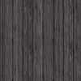
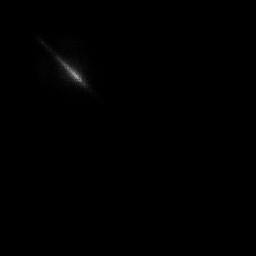
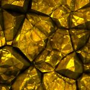
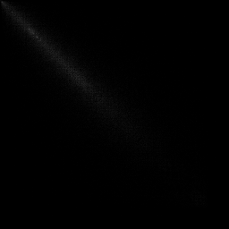
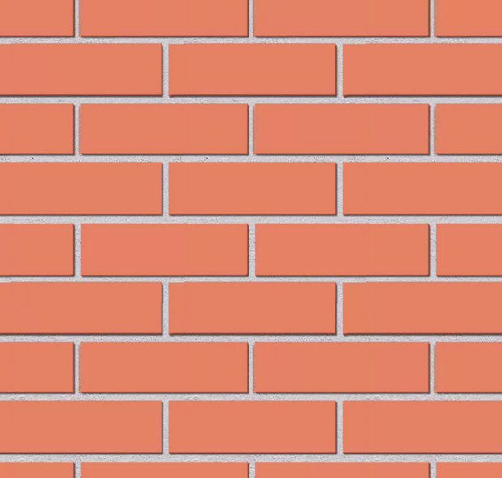
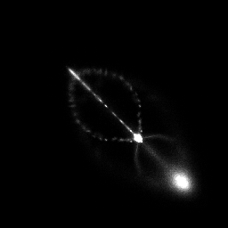

# Лабораторная работа No7. Текстурный анализ
Аскреткова Валентина
Б18-514

Матрица Харалика

`d=1, phi = {0, 90, 180, 270}`

### Исходное изображение

### Матрица Харалика

- Энергия ASM 0.00125917860

- Максимальная вероятность MPR  0.00450333194502

- Энтропия ENT 10.490107176

- След TR 0.08092982090795503
(0.0012591786017418474, 0.004503331945022908, 10.490107176868525, 0.08092982090795503)

### Исходное изображение

### Матрица Харалика

- Энергия ASM 0.0001376563

- Максимальная вероятность MPR  0.0007076

- Энтропия ENT 13.376467190

- След TR 0.033977812
(0.00013765638831189002, 0.0007076333089846604, 13.376467190512479, 0.033977812271731196)
### Исходное изображение

### Матрица Харалика

- Энергия ASM 0.2639530

- Максимальная вероятность MPR 0.5000637

- Энтропия ENT 5.1473764

- След TR 0.639573683

(0.2639530464457137, 0.5000637161473339, 5.147376413297254, 0.6395736835689908)

[comment]: <> (### Исходное изображение)

[comment]: <> (![]&#40;images/5.png&#41;)

[comment]: <> (### Матрица Харалика)

[comment]: <> (![]&#40;results/5.png&#41;)

[comment]: <> (- Энергия ASM 0.038607273848)

[comment]: <> (- Максимальная вероятность MPR  0.1521693965)

[comment]: <> (- Энтропия ENT 7.6979221)

[comment]: <> (- След TR 0.8575310)
