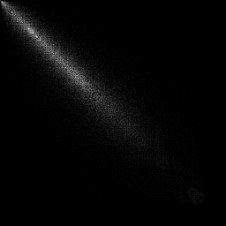
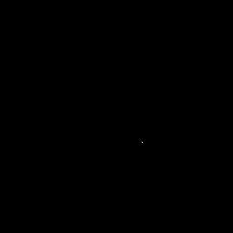
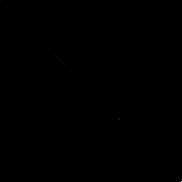

# Лабораторная работа No7. Текстурный анализ
Аскреткова Валентина
Б18-514

Матрица Харалика

`d=1, phi = {0, 90, 180, 270}`

### Исходное изображение

### Матрица Харалика

- Энергия ASM 0.00125917860

- Максимальная вероятность MPR  0.00450333194502

- Энтропия ENT 10.490107176

- След TR 0.08092982090795503

### Исходное изображение

### Матрица Харалика

- Энергия ASM 0.0001376563

- Максимальная вероятность MPR  0.0007076

- Энтропия ENT 13.376467190

- След TR 0.033977812

### Исходное изображение

### Матрица Харалика

- Энергия ASM 0.2639530

- Максимальная вероятность MPR 0.5000637

- Энтропия ENT 5.1473764

- След TR 0.639573683

### Исходное изображение

### Матрица Харалика

- Энергия ASM 0.038607273848

- Максимальная вероятность MPR  0.1521693965

- Энтропия ENT 7.6979221

- След TR 0.8575310
